# Programowanie genetyczne - raport końcowy

Autorzy: Dominik Breksa, Kaja Dzielnicka

1. [Funkcja dopasowania](#funkcja-dopasowania)
2. [Metryki](#metryki)
3. [Przkładowe zadania testowe](#przykładowe-zadania-testowe)
    - [1.1](#11a-program-powinien-wygenerować-na-wyjściu-na-dowolnej-pozycji-w-danych-wyjściowych-liczbę-1-poza-liczbą-1-może-też-zwrócić-inne-liczby)
    - [1.2](#12a-program-powinien-odczytać-dwie-pierwsze-liczy-z-wejścia-i-zwrócić-na-wyjściu-jedynie-ich-sumę-na-wejściu-mogą-być-tylko-całkowite-liczby-dodatnie-w-zakresie-09)
    - [1.3](#13a-program-powinien-odczytać-dwie-pierwsze-liczy-z-wejścia-i-zwrócić-na-wyjściu-jedynie-większą-z-nich-na-wejściu-mogą-być-tylko-całkowite-liczby-dodatnie-w-zakresie-09)
    - [1.4](#14a-program-powinien-odczytać-dziesięć-pierwszych-liczy-z-wejścia-i-zwrócić-na-wyjściu-jedynie-ich-średnią-arytmetyczną-zaokrągloną-do-pełnej-liczby-całkowitej-na-wejściu-mogą-być-tylko-całkowite-liczby-w-zakresie-9999)
4. [Finealne testy systemu](#finealne-testy-systemu)
    - [Benchmarki](#benchmark-1-number-io---given-an-integer-and-a-float-print-their-sum)
    - [Regresja symboliczna dla funkcji boolowskiej](#regresja-symboliczna-dla-funkcji-boolowskiej)

## Funkcja dopasowania
Klasa `FitnessFunctionBase` jest klasą bazową dla funkcji dopasowania. Funkcja `convert_output` służy do konwersji wyniku zwracanego przez program genetyczny na krotkę liczb całkowitych. Funkcja `calculate_fitness` sprawdza czy wynik jest niepusty i jeśli tak to wywołuje metodę `_calculate_fitness_impl`. Jest to metoda abstrakcyjna, która musi być zaimplementowana w klasie dziedziczącej. Funkcja ta przyjmuje wynik programu genetycznego oraz dane wejściowe (jeśli są) i zwraca wartość liczbową reprezentującą dopasowanie wyniku do oczekiwanego. 

```python
class FitnessFunctionBase(ABC):
    def convert_output(self, gp_output: Union[Tuple[int, ...], Tuple[float, ...], Tuple[bool, ...], None]) -> Tuple[int, ...]:
        if gp_output is None:
            return tuple()
        return tuple(int(x) if not isinstance(x, bool) else int(x) for x in gp_output)
    
    def calculate_fitness(self, gp_output: Union[Tuple[int, ...], Tuple[float, ...], Tuple[bool, ...], None], gp_input: Optional[Tuple[int, ...]] = None) -> int:
        if gp_output is None or len(gp_output) == 0: 
            return 100000
        converted_output = self.convert_output(gp_output)
        return self._calculate_fitness_impl(converted_output, gp_input)
    
    @abstractmethod
    def _calculate_fitness_impl(self, gp_output: Tuple[int, ...], gp_input: Optional[Tuple[int, ...]] = None) -> int:
        pass
```


## Metryki i ogólna konfiguracja

Konfiguracja parametrów uczenia:
```txt
Seed: 2147483648
Generations: 200
Population size: 10000
Crossover probability: 0.2
Mutation probability: 0.8
////////////// Dodatkowe informacje nie wypisywane
Ułamek populacji, który przeżywa do następnej generacji: 0.8
Minimalna wartość tokenu całkowitej: -64
Maksymalna wartość tokenu całkowitej: 64
Maksymalna głębokość osobnika dla populacji 0: 2

```

- `Seed` - Stan generatora losowego - wartość początkowa - losowa
- `Generations` - Maksymalna liczba generacji - 200
- `Population size` - Rozmiar populacji - 10000 - użyta metoda ramped half and half.
- `Crossover probability` - Prawdopodobieństwo krzyżowania - 0.2
- `Mutation probability` - Prawdopodobieństwo mutacji - 0.8 (1 - crossover probability)

## Przykładowe zadania testowe
### 1.1.A Program powinien wygenerować na wyjściu (na dowolnej pozycji w danych wyjściowych) liczbę 1. Poza liczbą 1 może też zwrócić inne liczby.

- status: <span style="color:green">**rozwiązanie znalezione**</span>


- funkcja dopasowania:
```python
class FitnessFunction1_1_A(FitnessFunctionBase):
    def _calculate_fitness_impl(self, gp_output: Tuple[int, ...], gp_input: Optional[Tuple[int, ...]] = None) -> int:
        closest_value = min(gp_output, key=lambda x: abs(x - 1))
        return abs(closest_value - 1) if 1 not in gp_output else 0
```

- najlepsze dopasowanie: 0 (znalezione w 1 generacji)

- najlepsze rozwiązanie:
```
{
	while (false) {
		if (true) {
			write(0);
			read(c2);
			c2 = (c2 * c2);
			RYbi = 51;
		} else {
			read(Xqg);
			read(Xqg);
			Qig2X = 24;
			read(Xqg);
		}
		HnH = ((1 - -7) + (61 / 44));
		HnH = -39;
		while (true) {
			read(HnH);
			z5A = (HnH + -46);
		}
	}
	while (!((5 == 27))) {
		if (((29 / 32) <= (20 / -8))) {
			read(QF);
			eSl = 63;
			eSl = (QF - -38);
			hp = (eSl - -36);
		} else {
			I3Z = 19;
			I3Z = I3Z;
			I3Z = -9;
			nhms = (22 - I3Z);
		}
		uDVk = ((40 * 57) / -64);
		read(uDVk);
		write((uDVk * uDVk));
	}
}
```

- najgorsze dopasowanie: 113674401

- średnie dopasowanie: 51929.46708620517

- czas wykonania: 8.476709632000166

- wykres najlepszego dopasowania, średniego dopasowania i czasu wykonania w zależności od numeru generacji:
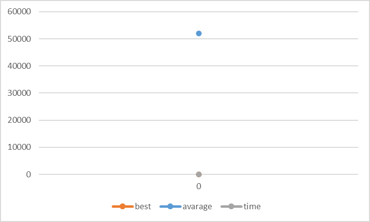

---

### 1.1.B Program powinien wygenerować na wyjściu (na dowolnej pozycji w danych wyjściowych) liczbę 789. Poza liczbą 789 może też zwrócić inne liczby.

- status: <span style="color:green">**rozwiązanie znalezione**</span>.


- funkcja dopasowania:
```python
class FitnessFunction1_1_B(FitnessFunctionBase):
    def _calculate_fitness_impl(self, gp_output: Tuple[int, ...], gp_input: Optional[Tuple[int, ...]] = None) -> int:
        closest_value = min(gp_output, key=lambda x: abs(x - 789))
        return abs(closest_value - 789) if 789 not in gp_output else 0
```

- najlepsze dopasowanie: 0 (znalezione w 22 generacji)

- najlepsze rozwiązanie:
```
{
	if (((-64 - -39) >= (32 / -43))) {
		if (true) {
			read(s);
			read(J2tJFj);
			read(u0H);
		} else {
			read(XF);
			write(2);
		}
		Hg2 = (XF + (XF - 43));
		if (false) {
			read(DC3);
			write((25 - (Si - 26)));
			ea = ((-32 + N6) + 48);
		} else {
			oV0 = vF1A;
			ZhhnV = (52 + lN);
			write((-57 + -15));
			write(24);
		}
	} else {
		if (((-52 == -56) || !(false))) {
			read(t9AT);
			YFy = ((xx4 * xx4) * -48);
			xx4 = UX5;
			read(t9AT);
		} else {
			read(za);
			write(32);
			za = (JJ7 - JJ7);
			za = za;
		}
		write(((7 * -33) - (-34 * 30)));
	}
	while (((-33 <= 18) && !(false))) {
		write((-43 * nc));
		if (!(!(false))) {
			write(X);
			read(ig);
			write(-31);
			read(X);
		} else {
			ig = -48;
			GCGFHj = (-26 - 27);
			kr2 = kr2;
			read(kr2);
		}
		while (true) {
			h = ((-3 / -23) - (-49 / 16));
			write((-9 / -24));
			VgI = VgI;
			h = h;
		}
		if (!((false && true))) {
			Os = -54;
			Os = (-21 / 61);
			read(kcKr);
			F = ((Uv - Uv) / Os);
		} else {
			wF6H = Zz;
			wF6H = (3 / -5);
			abZF = -17;
		}
	}
	while (false) {
		if ((-11 <= (54 / 25))) {
			read(E3k7);
			xYuX = -10;
		} else {
			read(uv);
			read(g);
			Fy = 11;
			read(yDbkH);
		}
		while (false) {
			read(uB);
			s9 = SCN;
			ZDJM__ = X;
			write(ZDJM__);
		}
	}
	if (((false && true) || (23 >= -37))) {
		while (((true || true) || (false || true))) {
			write(26);
			aoZ = ((-49 / 7) / (-57 + 6));
		}
		if (((-39 == -25) || false)) {
			read(jbGT);
			jbGT = yHD;
			write(-49);
		} else {
			read(Bw);
			read(Plfo);
		}
		write(MQR);
	} else {
		write(-9);
		if (!(true)) {
			qnv = 41;
			write(59);
			LUC8E = (-30 * 17);
			qnv = wn0n;
		}
	}
}
```

- najgorsze dopasowanie: 789

- średnie dopasowanie: 0.7547697532714015

- czas wykonania: 1198.0214798820016

- wykres najlepszego dopasowania, średniego dopasowania i czasu wykonania w zależności od numeru generacji:
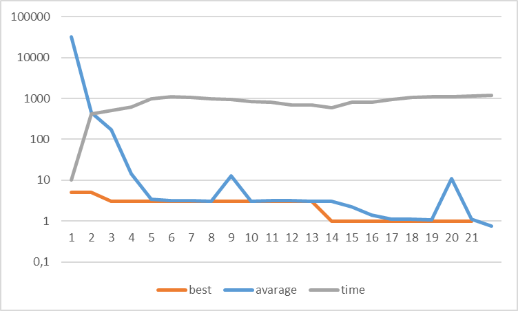
Wykres jest w skali logarytmicznej, aby lepiej zobrazować różnice w czasie wykonania.

---

### 1.1.C Program powinien wygenerować na wyjściu (na dowolnej pozycji w danych wyjściowych) liczbę 31415. Poza liczbą 31415 może też zwrócić inne liczby.

- status: <span style="color:green">**rozwiązanie znalezione**</span>.


- funkcja dopasowania:
```python
class FitnessFunction1_1_C(FitnessFunctionBase):
    def _calculate_fitness_impl(self, gp_output: Tuple[int, ...], gp_input: Optional[Tuple[int, ...]] = None) -> int:
        closest_value = min(gp_output, key=lambda x: abs(x - 31415))
        return abs(closest_value - 31415) if 31415 not in gp_output else 0
```

- najlepsze dopasowanie: 0 (znalezione w 39 generacji)

- najlepsze rozwiązanie:
```
{
	while (true) {
		if (((false || false) && (-58 == rN))) {
			b = ((24 / 21) * (-59 * 55));
			read(yd);
		} else {
			V = Q;
			write(VbI);
		}
		write((5 * (61 * (63 + 50))));
        write(VbI);
	}
	if (((34 < 47) || (-28 == -49))) {
		vehT_ = -22;
		if ((vehT_ <= (vehT_ * -17))) {
			vehT_ = (vehT_ / (UR * vehT_));
			read(C);
		}
	} else {
		read(G);
		while ((!(true) && !(false))) {
			read(QR);
			write(-31);
		}
	}
}
```

- najgorsze dopasowanie: 100000

- średnie dopasowanie: 66.5420037958246

- czas wykonania: 288.7342261789963

- wykres najlepszego dopasowania, średniego dopasowania i czasu wykonania w zależności od numeru generacji:
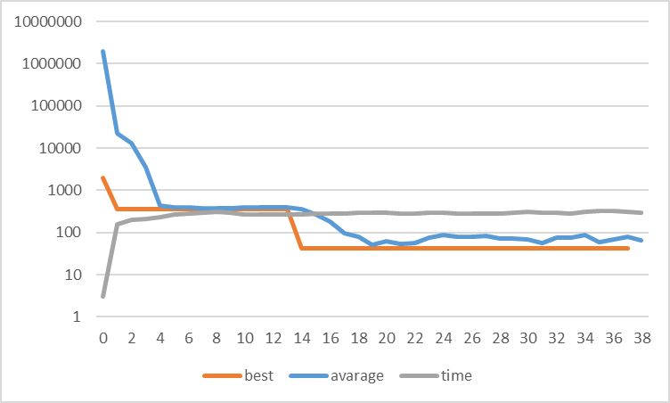
Wykres jest w skali logarytmicznej, aby lepiej zobrazować różnice w czasie wykonania.

---

### 1.1.D Program powinien wygenerować na pierwszej pozycji na wyjściu liczbę 1. Poza liczbą 1 może też zwrócić inne liczby.

- status: <span style="color:green">**rozwiązanie znalezione**</span>.


- funkcja dopasowania:
```python
class FitnessFunction1_1_D(FitnessFunctionBase):
    def _calculate_fitness_impl(self, gp_output: Tuple[int, ...], gp_input: Optional[Tuple[int, ...]] = None) -> int:
        return abs(gp_output[0] - 1) if gp_output[0] != 1 else 0
```

- najlepsze dopasowanie: 0 (znalezione w 1 generacji)

- najlepsze rozwiązanie:
```
{
	while (true) {
		if (true) {
			read(Hr);
			read(id);
			write(id);
		}
		read(R0gr);
		R0gr = -38;
		FO_ = (15 / 37);
	}
	while (false) {
		if ((!(false) && false)) {
			read(SY);
			read(Hwi2);
			SY = -7;
		} else {
			Q = -12;
			c0 = 27;
			bZezl = c0;
			bZezl = (-13 * c0);
		}
		write((56 - -51));
		while (!(!(false))) {
			read(mcl);
			read(mcl);
			X = (mcl + 19);
			mcl = mcl;
		}
		while (((false && true) || true)) {
			read(d9et);
			x = (23 / (d9et - -18));
			d9et = (d9et + (4 + -42));
			write((-41 / 46));
		}
	}
	while (true) {
		if ((true || !(false))) {
			a6E = 29;
			VaCY = (2 * a6E);
			Z = -30;
			InSzE = (-29 + 11);
		}
		Y = -60;
	}
	if (!((false && false))) {
		IpZ = ((-23 + 60) - -5);
		if (!((63 >= -38))) {
			read(IpZ);
			t = (IpZ - -2);
		}
		while (!((false && true))) {
			write(((IpZ + IpZ) - IpZ));
			rpj = 54;
			read(o1x);
			IpZ = rpj;
		}
		while (((false && true) || !(false))) {
			IpZ = -25;
			write((-4 * (IpZ - IpZ)));
		}
	} else {
		if (!(true)) {
			read(Z2);
			Gxh = 18;
		} else {
			W9Q = (40 + -14);
			read(m9p3ql);
			uE = (8 * (15 / m9p3ql));
			read(jR);
		}
		while (((true && false) && !(false))) {
			read(J7ZYH);
			read(J7ZYH);
		}
		bpqH = ((-55 - 50) + 31);
	}
}
```

- najgorsze dopasowanie: 425884579

- średnie dopasowanie: 110602.04914593947

- czas wykonania: 106.85491112899945

- wykres najlepszego dopasowania, średniego dopasowania i czasu wykonania w zależności od numeru generacji:
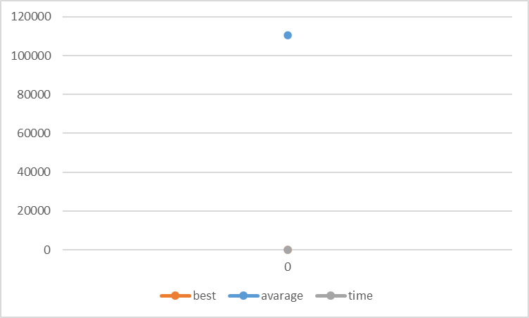

---

### 1.1.E Program powinien wygenerować na pierwszej pozycji na wyjściu liczbę 789. Poza liczbą 789 może też zwrócić inne liczby.

- status: <span style="color:green">**rozwiązanie znalezione**</span>.


- funkcja dopasowania:
```python
class FitnessFunction1_1_E(FitnessFunctionBase):
    def _calculate_fitness_impl(self, gp_output: Tuple[int, ...], gp_input: Optional[Tuple[int, ...]] = None) -> int:
        return abs(gp_output[0] - 789) if gp_output[0] != 789 else 0
```

- najlepsze dopasowanie: 0 (znalezione w 11 generacji)

- najlepsze rozwiązanie:
```
{
	while (!((40 <= 59))) {
		while (!((0 != 7))) {
			RdoC = (46 + (-49 / -30));
			F = (RdoC + RdoC);
			write((F * RdoC));
			vt = -42;
		}
		write(((1 - -10) + (-35 * 60)));
		while (!((-59 == -40))) {
			write(-18);
			V = (16 * 41);
			V = V;
			V = -12;
		}
		kYB6 = 57;
	}
	while (false) {
		Sr = ((-7 * 23) - (5 * 42));
		write(Sr);
		Sr = 57;
		if ((Sr >= (Sr + 33))) {
			write(((58 - Sr) * (Sr + -3)));
			read(xw);
			Sr = xw;
			Sr = Sr;
		}
	}
	if ((24 != (-52 * -2))) {
		read(U);
		while (((60 < U) && (true || false))) {
			read(U);
			read(Ccv);
			write((Ccv / (U + 35)));
		}
		if (!((true && false))) {
			Z7Z = (-31 / 60);
			U = U;
			write((-51 + (-56 * -15)));
		} else {
			write(U);
			U = (-2 + U);
			U = U;
		}
		while (((-43 + U) > (U + -26))) {
			read(U);
			U = (-15 * U);
			read(VZ9);
			read(g4Axv);
		}
	} else {
		read(F9);
		read(n);
	}
	while ((42 >= 3)) {
		Q3q_ = 40;
		read(UM);
		uEuU = Q3q_;
	}
}
```

- najgorsze dopasowanie: 803

- średnie dopasowanie: 3.1034861652182597

- czas wykonania: 827.8232113710019

- wykres najlepszego dopasowania, średniego dopasowania i czasu wykonania w zależności od numeru generacji:
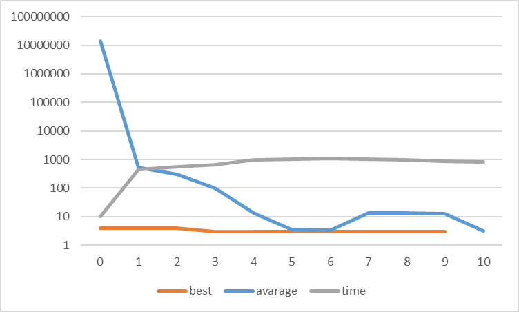
Wykres jest w skali logarytmicznej, aby lepiej zobrazować różnice w czasie wykonania.

---

### 1.1.F Program powinien wygenerować na wyjściu liczbę jako jedyną liczbę 1. Poza liczbą 1 NIE powinien nic więcej wygenerować.

- status: <span style="color:green">**rozwiązanie znalezione**</span>.


- funkcja dopasowania:
```python
class FitnessFunction1_1_F(FitnessFunctionBase):
    def _calculate_fitness_impl(self, gp_output: Tuple[int, ...], gp_input: Optional[Tuple[int, ...]] = None) -> int:
        return 0 if len(gp_output) == 1 and gp_output[0] == 1 else 9999999
```

- najlepsze dopasowanie: 0 (znalezione w 1 generacji)

- najlepsze rozwiązanie:
```
{
	Bcx = -37;
	if (false) {
		while (((true && false) || false)) {
			utE = Bcx;
			Bcx = utE;
			read(Bcx);
			write(64);
		}
		while (false) {
			L = 62;
			F3 = -62;
			read(q5);
		}
	}
	if (false) {
		if (!((Bcx < 31))) {
			Bcx = 47;
			write(Bcx);
			read(Bcx);
			iJY = 27;
		} else {
			Frn = Bcx;
			read(LpiI);
		}
		if ((true || (true && true))) {
			read(Bcx);
			y1Q = 62;
			read(TSiI);
			pmAna = 62;
		}
		read(w9S);
		Bcx = w9S;
	} else {
		if (((true && false) || !(false))) {
			Bcx = (Bcx / Bcx);
			Esc = Bcx;
			T_C1 = -53;
			rZYq = 26;
		} else {
			write((2 / (-11 / -21)));
			write(Bcx);
			rX = Bcx;
		}
		if (!(!(false))) {
			Bcx = 31;
			la = -59;
			yj = 40;
		} else {
			write(1);
			read(Bcx);
			FyS = Bcx;
		}
		while (!((false || false))) {
			Bcx = (-59 * Bcx);
			Bcx = ((Bcx + Bcx) - -38);
		}
		if (((15 - 57) < Bcx)) {
			I9hm = Bcx;
			O = (Bcx - I9hm);
		} else {
			Bcx = -58;
			Bcx = (Bcx * (Bcx + -35));
			write(-19);
			write(-53);
		}
	}
}
```

- najgorsze dopasowanie: 9999999

- średnie dopasowanie: 6889400.972230546

- czas wykonania: 10.265593879000335

- wykres najlepszego dopasowania, średniego dopasowania i czasu wykonania w zależności od numeru generacji:
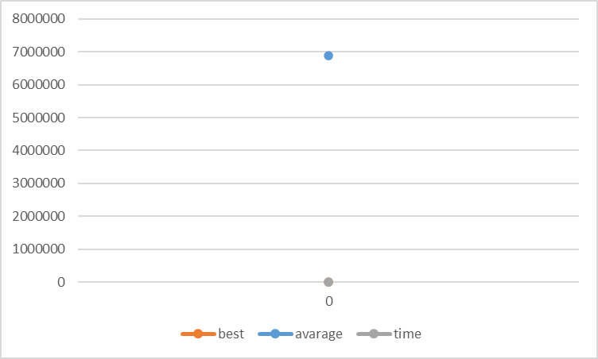

---

### 1.2.A Program powinien odczytać dwie pierwsze liczy z wejścia i zwrócić na wyjściu (jedynie) ich sumę. Na wejściu mogą być tylko całkowite liczby dodatnie w zakresie [0,9]

- status: <span style="color:green">**rozwiązanie znalezione**</span>.


- funkcja dopasowania:
```python
class FitnessFunction1_2_A(FitnessFunctionBase):
    def _calculate_fitness_impl(self, gp_output: Tuple[int, ...], gp_input: Optional[Tuple[int, ...]] = None) -> int:
        expected_result = sum(gp_input[:2])
        return abs(gp_output[0] - expected_result) if len(gp_output) == 1 else 9999999
```

- najlepsze dopasowanie: 0 (znalezione w 2 generacji)

- najlepsze rozwiązanie:
```
{
	RQ = (11 / -22);
	if (true) {
		read(O);
		RQ = (13 + 53);
		Otg = (RQ - 19);
		read(ngM);
	} else {
		while ((cbe >= -60)) {
			cbe = (RQ + cbe);
			write(Sm);
		}
		while (((cbe < 59) || (false && false))) {
			tBr9 = cbe;
			Rf5 = tBr9;
			RQ = 43;
			t = 5;
		}
	}
	write((W + kcOl));
	RQ = ((kcOl * kcOl) * (kcOl + RQ));
}
```

- najgorsze dopasowanie: 10000000

- średnie dopasowanie: 2848711.1979822195

- czas wykonania: 376.5042307450003

- wykres najlepszego dopasowania, średniego dopasowania i czasu wykonania w zależności od numeru generacji:
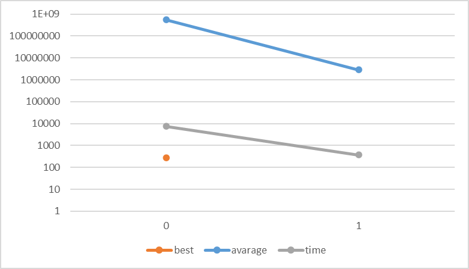
Wykres jest w skali logarytmicznej, aby lepiej zobrazować różnice w czasie wykonania.

---

### 1.2.B Program powinien odczytać dwie pierwsze liczy z wejścia i zwrócić na wyjściu (jedynie) ich sumę. Na wejściu mogą być tylko całkowite liczby w zakresie [-9,9]

- status: <span style="color:green">**rozwiązanie znalezione**</span>.


- funkcja dopasowania:
```python
class FitnessFunction1_2_B(FitnessFunctionBase):
    def _calculate_fitness_impl(self, gp_output: Tuple[int, ...], gp_input: Optional[Tuple[int, ...]] = None) -> int:
        expected_result = sum(gp_input[:2])
        return abs(gp_output[0] - expected_result) if len(gp_output) == 1 else 9999999
```

- najlepsze dopasowanie: 0 (znalezione w 2 generacji)

- najlepsze rozwiązanie:
```
Best program: {
	read(gNx);
	MIn = -24;
	while (false) {
		while (!((FQ5Ro >= 30))) {
			write((H2 - 19));
			rc8m = 31;
			o = eNOjX;
			MIn = (p_ + (HJ * Z));
		}
		write(50);
		MIn = -2;
	}
	write((eg5sE + y9));
}
```

- najgorsze dopasowanie: 3609999639

- średnie dopasowanie: 13523643.220157826

- czas wykonania: 718.2003772829994

- wykres najlepszego dopasowania, średniego dopasowania i czasu wykonania w zależności od numeru generacji:
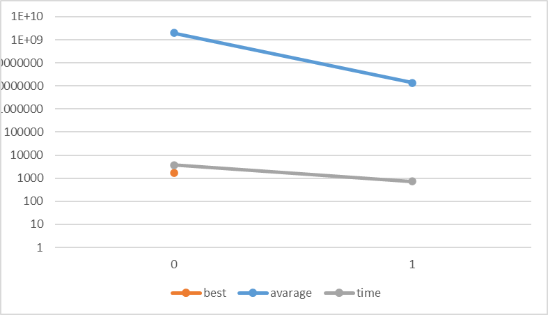
Wykres jest w skali logarytmicznej, aby lepiej zobrazować różnice w czasie wykonania.

---

### 1.2.C Program powinien odczytać dwie pierwsze liczy z wejścia i zwrócić na wyjściu (jedynie) ich sumę. Na wejściu mogą być tylko całkowite liczby dodatnie w zakresie [-9999,9999]

- status: <span style="color:green">**rozwiązanie znalezione**</span>.


- funkcja dopasowania:
```python
class FitnessFunction1_2_C(FitnessFunctionBase):
    def _calculate_fitness_impl(self, gp_output: Tuple[int, ...], gp_input: Optional[Tuple[int, ...]] = None) -> int:
        expected_result = sum(gp_input[:2])
        return abs(gp_output[0] - expected_result) if len(gp_output) == 1 else 9999999
```

- najlepsze dopasowanie: 0 (znalezione w 2 generacji)

- najlepsze rozwiązanie:
```
{
	read(g);
	write((ZQ4KU + cP));
}
```

- najgorsze dopasowanie: 37209996279

- średnie dopasowanie: 121156206.5834582

- czas wykonania: 1799.1027900150002

- wykres najlepszego dopasowania, średniego dopasowania i czasu wykonania w zależności od numeru generacji:
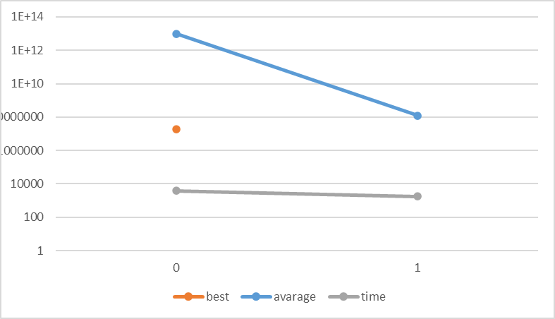
Wykres jest w skali logarytmicznej, aby lepiej zobrazować różnice w czasie wykonania.

---

### 1.2.D Program powinien odczytać dwie pierwsze liczy z wejścia i zwrócić na wyjściu (jedynie) ich różnicę. Na wejściu mogą być tylko całkowite liczby dodatnie w zakresie [-9999,9999]

- status: <span style="color:green">**rozwiązanie znalezione**</span>.


- funkcja dopasowania:
```python
class FitnessFunction1_2_D(FitnessFunctionBase):
    def _calculate_fitness_impl(self, gp_output: Tuple[int, ...], gp_input: Optional[Tuple[int, ...]] = None) -> int:
        expected_result = gp_input[0] - gp_input[1]
        return abs(gp_output[0] - expected_result) if len(gp_output) == 1 else 9999999
```

- najlepsze dopasowanie: 0 (znalezione w 2 generacji)

- najlepsze rozwiązanie:
```
{
	while (!(!(false))) {
		read(L6UQ);
		L6UQ = 9;
		while (((-1 >= kTI) || true)) {
			read(qO);
			kzo = -37;
			write((35 * kzo));
			ExW8Z1 = 31;
		}
		while ((false || false)) {
			write(64);
			write(28);
			read(O);
		}
	}
	write(((Qqpt - hC0) / (Qqpt / Qqpt)));
	while ((true && false)) {
		while (((-27 > u) && (false || true))) {
			u = u;
			QBQ8 = -12;
			read(Sc);
			Sc = QBQ8;
		}
		read(L2uB);
	}
	while ((!(true) || (-11 < -48))) {
		rL90CYF = -43;
		write(-8);
	}
}
```

- najgorsze dopasowanie: 372100000

- średnie dopasowanie: 135923185.98182

- czas wykonania: 4638.79218706

- wykres najlepszego dopasowania, średniego dopasowania i czasu wykonania w zależności od numeru generacji:
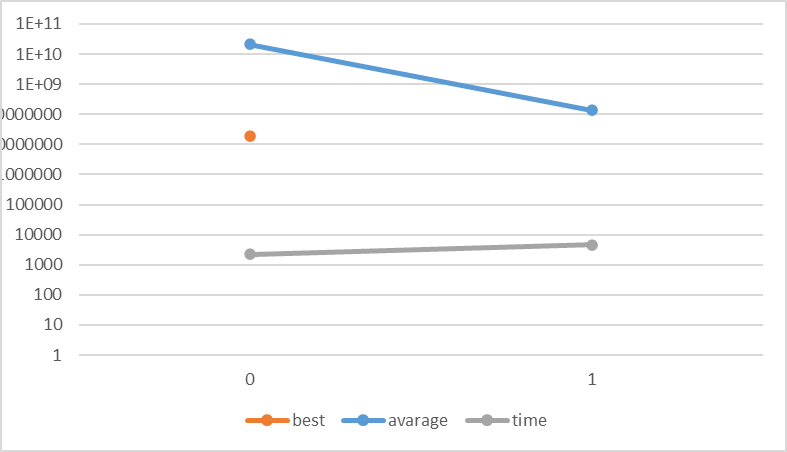
Wykres jest w skali logarytmicznej, aby lepiej zobrazować różnice w czasie wykonania.

---

### 1.2.E Program powinien odczytać dwie pierwsze liczy z wejścia i zwrócić na wyjściu (jedynie) ich iloczyn. Na wejściu mogą być tylko całkowite liczby dodatnie w zakresie [-9999,9999]

- status: <span style="color:green">**rozwiązanie znalezione**</span>.


- funkcja dopasowania:
```python
class FitnessFunction1_2_E(FitnessFunctionBase):
    def _calculate_fitness_impl(self, gp_output: Tuple[int, ...], gp_input: Optional[Tuple[int, ...]] = None) -> int:
        expected_result = gp_input[0] * gp_input[1]
        return abs(gp_output[0] - expected_result) if len(gp_output) == 1 else 9999999
```

- najlepsze dopasowanie: 0 (znalezione w 2 generacji)

- najlepsze rozwiązanie:
```
{
	while ((!(true) || !(true))) {
		read(q);
		write(-7);
	}
	if (!(!(true))) {
		if (!(!(false))) {
			yVoz = -13;
			VTf = (VTf - (17 + 36));
		} else {
			write((tu * le));
			read(MBA);
		}
		SABph = vns7;
	} else {
		while ((tv_ != le)) {
			read(rz);
			read(rz);
		}
		tv_ = 52;
	}
}
```

- najgorsze dopasowanie: 37209996279

- średnie dopasowanie: 272335556.65987414

- czas wykonania: 1224.0368334489976

- wykres najlepszego dopasowania, średniego dopasowania i czasu wykonania w zależności od numeru generacji:
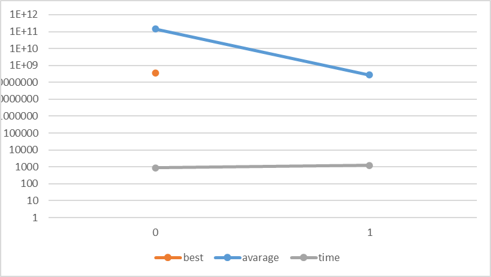

---

### 1.3.A Program powinien odczytać dwie pierwsze liczy z wejścia i zwrócić na wyjściu (jedynie) większą z nich. Na wejściu mogą być tylko całkowite liczby dodatnie w zakresie [0,9]

- status: <span style="color:green">**rozwiązanie znalezione**</span>.


- funkcja dopasowania:
```python
class FitnessFunction1_3_A(FitnessFunctionBase):
    def _calculate_fitness_impl(self, gp_output: Tuple[int, ...], gp_input: Optional[Tuple[int, ...]] = None) -> int:
        expected_result = max(gp_input[:2])
        return abs(gp_output[0] - expected_result) if len(gp_output) == 1 else 9999999
```

- najlepsze dopasowanie: 0 (znalezione w 10 generacji)

- najlepsze rozwiązanie:
```
{
	if ((gxs9Zy > ahyNY)) {
		fVGk = NFK;
		while (false) {
			S = (-27 + (eE * -30));
			read(nK);
			M = ((-7 - P) - P);
			write(y);
		}
		if ((-17 < 56)) {
			read(NFK);
			write(fVGk);
			gR3 = fVGk;
			read(s);
		} else {
			read(QslHZ);
			write((J2Rz / (NFK * 26)));
			read(J2Rz);
			K6Yz = -61;
		}
		while ((true || true)) {
			rKlLPs = (NFK / -22);
			NFK = 30;
			rKlLPs = 46;
		}
	} else {
		if ((58 <= -53)) {
			write(44);
			ca = -33;
			write(-36);
			Kpj = ca;
		} else {
			xBLr = (35 / 62);
			xBLr = (Kk / Kk);
			write(A8uu);
			read(jrPF);
		}
		while ((41 == (49 * -50))) {
			write(60);
			UF4H7 = -57;
			read(Ov);
			dHa = (-2 - 39);
		}
		while (((7 > 26) && (34 >= 22))) {
			aF = ((48 - 32) / (-1 * -23));
			write((26 / (46 * l)));
			Tz = -5;
		}
	}
	ahyNY = 44;
}
```

- najgorsze dopasowanie: 10000000

- średnie dopasowanie: 1031.0083907701528

- czas wykonania: 846.361679900001

- wykres najlepszego dopasowania, średniego dopasowania i czasu wykonania w zależności od numeru generacji:

Wykres jest w skali logarytmicznej, aby lepiej zobrazować różnice w czasie wykonania.

---

### 1.3.B Program powinien odczytać dwie pierwsze liczy z wejścia i zwrócić na wyjściu (jedynie) większą z nich. Na wejściu mogą być tylko całkowite liczby w zakresie [-9999,9999]

- status: <span style="color:green">**rozwiązanie znalezione**</span>.


- funkcja dopasowania:
```python
class FitnessFunction1_3_B(FitnessFunctionBase):
    def _calculate_fitness_impl(self, gp_output: Tuple[int, ...], gp_input: Optional[Tuple[int, ...]] = None) -> int:
        expected_result = max(gp_input[:2])
        return abs(gp_output[0] - expected_result) if len(gp_output) == 1 else 9999999
```

- najlepsze dopasowanie: 0 (znalezione w 2 generacji)

- najlepsze rozwiązanie:
```
{
	while (false) {
		ifQ = 1;
		D6 = -22;
		if (((true || false) && (D6 > Rg))) {
			D6 = -62;
			read(rn);
			K = (D6 / (yd - D6));
			read(Dz7);
		} else {
			read(OC);
			write((dO - (dO / 5)));
			T5 = tL;
			UevF = (o + nn62);
		}
		write(D6);
	}
	if ((true || (-9 >= 40))) {
		read(c);
		while ((I < c)) {
			NJ = -45;
			I = g5o;
			g5o = ((-29 * 23) * -6);
			PMmr = 42;
		}
		if (false) {
			pw = 58;
			qp9Vg = 17;
			write(-39);
			I = -18;
		} else {
			read(lJ);
			write(I);
			read(c);
			V1G5 = (-26 * -58);
		}
	} else {
		while (!(false)) {
			write(MfDhMH);
			write(PM0nQd);
		}
		QRX = (28 * -35);
		write((Es - Q9T));
	}
}
```

- najgorsze dopasowanie: 37209996279

- średnie dopasowanie: 176864420.07461792

- czas wykonania: 3935.7622341529986

- wykres najlepszego dopasowania, średniego dopasowania i czasu wykonania w zależności od numeru generacji:

Wykres jest w skali logarytmicznej, aby lepiej zobrazować różnice w czasie wykonania.

---

### 1.4.A Program powinien odczytać dziesięć pierwszych liczy z wejścia i zwrócić na wyjściu (jedynie) ich średnią arytmetyczną (zaokrągloną do pełnej liczby całkowitej). Na wejściu mogą być tylko całkowite liczby w zakresie [-99,99]

- status: <span style="color:green">**rozwiązanie znalezione**</span>.


- funkcja dopasowania:
```python

```

- najlepsze dopasowanie: 

- najlepsze rozwiązanie:
```

```

- najgorsze dopasowanie: 

- średnie dopasowanie: 

- czas wykonania:

- wykres najlepszego dopasowania, średniego dopasowania i czasu wykonania w zależności od numeru generacji:


---

### 1.4.B Program powinien odczytać na początek z wejścia pierwszą liczbę (ma być to wartość nieujemna) a następnie tyle liczb (całkowitych) jaka jest wartość pierwszej odczytanej liczby i zwrócić na wyjściu (jedynie) ich średnią arytmetyczną zaokrągloną do pełnej liczby całkowitej (do średniej nie jest wliczana pierwsza odczytana liczba, która mówi z ilu liczb chcemy obliczyć średnią). Na wejściu mogą być tylko całkowite liczby w zakresie [-99,99], pierwsza liczba może być tylko w zakresie [0,99].

- status: <span style="color:red">**rozwiązanie nieznalezione**</span>.


- funkcja dopasowania:
```python

```

- najlepsze dopasowanie: 

- najlepsze rozwiązanie:
```

```

- najgorsze dopasowanie: 

- średnie dopasowanie: 

- czas wykonania:

- wykres najlepszego dopasowania, średniego dopasowania i czasu wykonania w zależności od numeru generacji:


## Finealne testy systemu

### Benchmark 1. Number IO - Given an integer and a float, print their sum.

- status: <span style="color:red">**rozwiązanie nieznalezione**</span>.


- funkcja dopasowania:
```python

```

- najlepsze dopasowanie: 

- najlepsze rozwiązanie:
```

```

- najgorsze dopasowanie: 

- średnie dopasowanie: 

- czas wykonania:

- wykres najlepszego dopasowania, średniego dopasowania i czasu wykonania w zależności od numeru generacji:
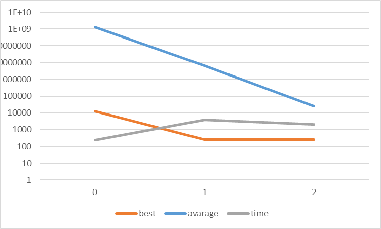

---

### Benchmark 21. Negative To Zero - Given a vector of integers, return the vector where all negative integers have been replaced by 0.

- status: <span style="color:red">**rozwiązanie nieznalezione**</span>.


- funkcja dopasowania:
```python

```

- najlepsze dopasowanie: 

- najlepsze rozwiązanie:
```

```

- najgorsze dopasowanie: 

- średnie dopasowanie: 

- czas wykonania:

- wykres najlepszego dopasowania, średniego dopasowania i czasu wykonania w zależności od numeru generacji:
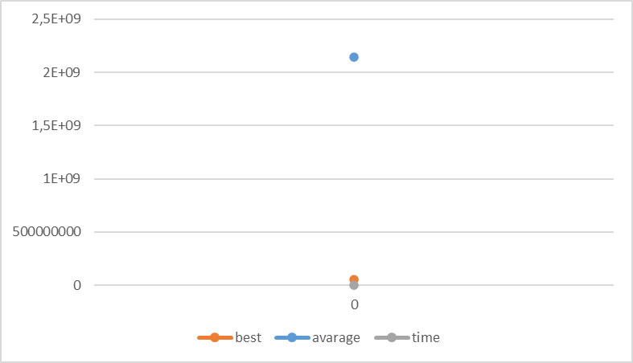

---

### Benchmark 28. Smallest - Given four integers, print the smallest of them.

- status: <span style="color:red">**rozwiązanie nieznalezione**</span>.


- funkcja dopasowania:
```python

```

- najlepsze dopasowanie: 

- najlepsze rozwiązanie:
```

```

- najgorsze dopasowanie: 

- średnie dopasowanie: 

- czas wykonania:

- wykres najlepszego dopasowania, średniego dopasowania i czasu wykonania w zależności od numeru generacji:
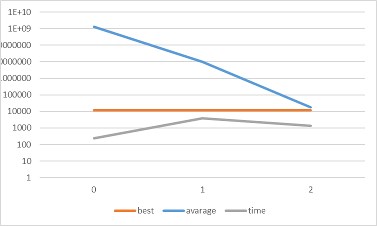

---

### Regresja symboliczna dla funkcji boolowskiej
