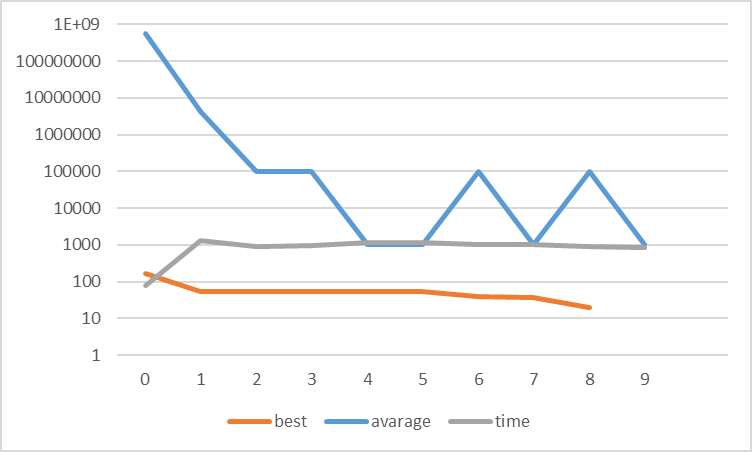
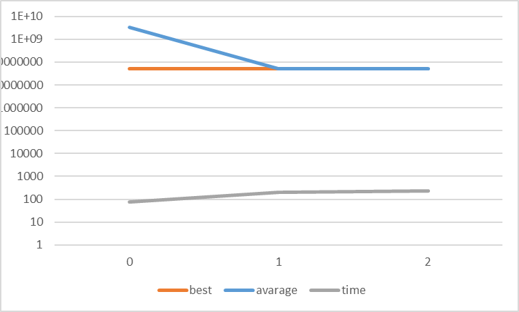
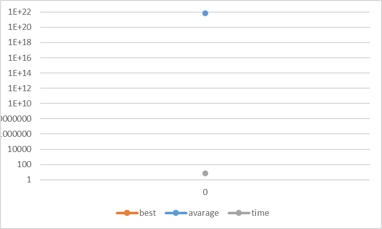
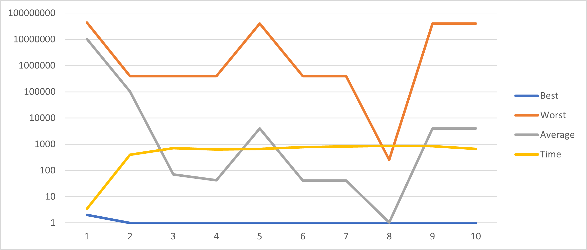
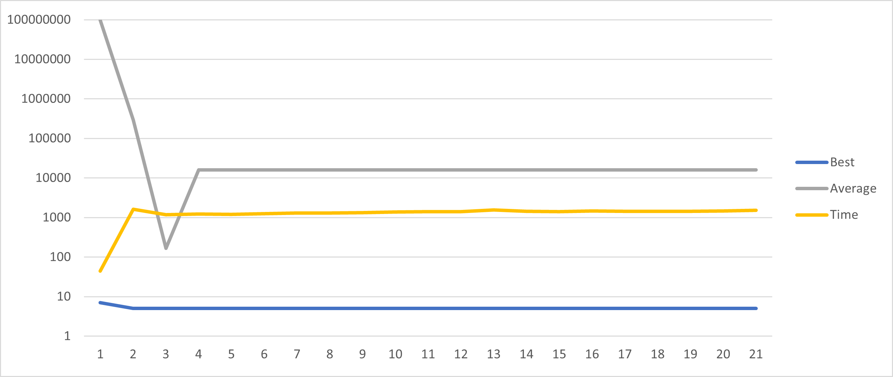

# Programowanie genetyczne - raport końcowy

Autorzy: Dominik Breksa, Kaja Dzielnicka

Spis treści:

1. [Funkcja dopasowania](#funkcja-dopasowania)
2. [Metryki i ogólna konfiguracja problemów](#metryki-i-ogólna-konfiguracja-problemów)
3. [Przykładowe zadania testowe](#przykładowe-zadania-testowe)
    - [1.1](#11a-program-powinien-wygenerować-na-wyjściu-na-dowolnej-pozycji-w-danych-wyjściowych-liczbę-1-poza-liczbą-1-może-też-zwrócić-inne-liczby)
    - [1.2](#12a-program-powinien-odczytać-dwie-pierwsze-liczy-z-wejścia-i-zwrócić-na-wyjściu-jedynie-ich-sumę-na-wejściu-mogą-być-tylko-całkowite-liczby-dodatnie-w-zakresie-09)
    - [1.3](#13a-program-powinien-odczytać-dwie-pierwsze-liczy-z-wejścia-i-zwrócić-na-wyjściu-jedynie-większą-z-nich-na-wejściu-mogą-być-tylko-całkowite-liczby-dodatnie-w-zakresie-09)
    - [1.4](#14a-program-powinien-odczytać-dziesięć-pierwszych-liczy-z-wejścia-i-zwrócić-na-wyjściu-jedynie-ich-średnią-arytmetyczną-zaokrągloną-do-pełnej-liczby-całkowitej-na-wejściu-mogą-być-tylko-całkowite-liczby-w-zakresie-9999)
4. [Finalne testy systemu](#finealne-testy-systemu)
    - [Benchmarki](#benchmark-1-number-io---given-an-integer-and-a-float-print-their-sum)
    - [Regresja symboliczna dla funkcji bool-owskiej](#regresja-symboliczna-dla-funkcji-boolowskiej)

## Funkcja dopasowania
Klasa `FitnessFunctionBase` jest klasą bazową dla funkcji dopasowania. Funkcja `convert_output` służy do konwersji wyniku zwracanego przez program genetyczny na krotkę liczb całkowitych. Metoda `calculate_fitness` sprawdza czy wynik jest niepusty i jeśli tak to wywołuje metodę `_calculate_fitness_impl`. Jest to metoda abstrakcyjna, która musi być zaimplementowana w klasie dziedziczącej. Funkcja ta przyjmuje wynik programu genetycznego oraz dane wejściowe (jeśli są) i zwraca wartość liczbową reprezentującą dopasowanie wyniku do oczekiwanego.

```python
from abc import ABC, abstractmethod
from typing import Tuple, Union, Optional


class FitnessFunctionBase(ABC):
	@staticmethod
	def convert_output(gp_output: Union[Tuple[int, ...], Tuple[float, ...], Tuple[bool, ...], None]) -> Tuple[int, ...]:
		if gp_output is None:
			return tuple()
		return tuple(int(x) if not isinstance(x, bool) else int(x) for x in gp_output)

	def calculate_fitness(self, gp_output: Union[Tuple[int, ...], Tuple[float, ...], Tuple[bool, ...], None],
						  gp_input: Optional[Tuple[int, ...]] = None) -> int:
		if gp_output is None or len(gp_output) == 0:
			return 100000
		converted_output = self.convert_output(gp_output)
		return self._calculate_fitness_impl(converted_output, gp_input)

	@abstractmethod
	def _calculate_fitness_impl(self, gp_output: Tuple[int, ...], gp_input: Optional[Tuple[int, ...]] = None) -> int:
		pass
```

## Metryki i ogólna konfiguracja problemów

#### Konfiguracja głównych parametrów uczenia:
- Ziarno generatora: `2147483648` (losowy, zawsze).
- Maksymalna liczba generacji: `200` (licząc od generacji zero).
- Liczba populacji: `10000`, dla problemów zaawansowanych (benchmarks) `5000`.
- Crossover probability: `0,2` (benchmarks: `0,6`).
- Mutation probability: `0,8` (benchmarks: `0,4`).
- Ułamek populacji, który przeżywa do następnej generacji: `0,8` (benchmarks: `0,5`).
- Maksymalna głębokość osobnika: `2` (benchmarks: `3`).
- Maksymalna liczba węzłów w bloku: `4` (liczona osobno dla każdego bloku).
- Minimalna generowana wartość tokenu całkowitej: `-64`.
- Maksymalna generowana wartość tokenu całkowitej: `64`.

#### Metryki używane do ilustracji procesu uczenia:
- **Najlepsze dopasowanie**: najlepsze dopasowanie znalezione w trakcie uczenia dla danej generacji (błąd jest najmniejszy).
- **Najgorsze dopasowanie**: najgorsze dopasowanie znalezione w trakcie uczenia dla danej generacji (błąd jest największy).
- **Średnie dopasowanie**: średnie dopasowanie znalezione w trakcie uczenia dla danej generacji (suma błędu całej populacji przez jej ilość).
- **Czas wykonania**: czas liczenia się tej konkretnej generacji w sekundach.

## Przykładowe zadania testowe
### 1.1.A Program powinien wygenerować na wyjściu (na dowolnej pozycji w danych wyjściowych) liczbę 1. Poza liczbą 1 może też zwrócić inne liczby.

- status: <span style="color:green">**rozwiązanie znalezione**</span>


- funkcja dopasowania:
```python
from typing import Tuple, Optional 

class FitnessFunction1_1_A(FitnessFunctionBase):
    def _calculate_fitness_impl(self, gp_output: Tuple[int, ...], gp_input: Optional[Tuple[int, ...]] = None) -> int:
        closest_value = min(gp_output, key=lambda x: abs(x - 1))
        return abs(closest_value - 1) if 1 not in gp_output else 0
```

- najlepsze dopasowanie: 0 (znalezione w 1 generacji)

- najlepsze rozwiązanie:
```
{
	while (false) {
		if (true) {
			write(0);
			read(c2);
			c2 = (c2 * c2);
			RYbi = 51;
		} else {
			read(Xqg);
			read(Xqg);
			Qig2X = 24;
			read(Xqg);
		}
		HnH = ((1 - -7) + (61 / 44));
		HnH = -39;
		while (true) {
			read(HnH);
			z5A = (HnH + -46);
		}
	}
	while (!((5 == 27))) {
		if (((29 / 32) <= (20 / -8))) {
			read(QF);
			eSl = 63;
			eSl = (QF - -38);
			hp = (eSl - -36);
		} else {
			I3Z = 19;
			I3Z = I3Z;
			I3Z = -9;
			nhms = (22 - I3Z);
		}
		uDVk = ((40 * 57) / -64);
		read(uDVk);
		write((uDVk * uDVk));
	}
}
```

- najgorsze dopasowanie: 113674401

- średnie dopasowanie: 51929.46708620517

- czas wykonania: 8.476709632000166

- wykres najlepszego dopasowania, średniego dopasowania i czasu wykonania w zależności od numeru generacji:


---

### 1.1.B Program powinien wygenerować na wyjściu (na dowolnej pozycji w danych wyjściowych) liczbę 789. Poza liczbą 789 może też zwrócić inne liczby.

- status: <span style="color:green">**rozwiązanie znalezione**</span>.


- funkcja dopasowania:
```python
class FitnessFunction1_1_B(FitnessFunctionBase):
    def _calculate_fitness_impl(self, gp_output: Tuple[int, ...], gp_input: Optional[Tuple[int, ...]] = None) -> int:
        closest_value = min(gp_output, key=lambda x: abs(x - 789))
        return abs(closest_value - 789) if 789 not in gp_output else 0
```

- najlepsze dopasowanie: 0 (znalezione w 22 generacji)

- najlepsze rozwiązanie:
```
{
	if (((-64 - -39) >= (32 / -43))) {
		if (true) {
			read(s);
			read(J2tJFj);
			read(u0H);
		} else {
			read(XF);
			write(2);
		}
		Hg2 = (XF + (XF - 43));
		if (false) {
			read(DC3);
			write((25 - (Si - 26)));
			ea = ((-32 + N6) + 48);
		} else {
			oV0 = vF1A;
			ZhhnV = (52 + lN);
			write((-57 + -15));
			write(24);
		}
	} else {
		if (((-52 == -56) || !(false))) {
			read(t9AT);
			YFy = ((xx4 * xx4) * -48);
			xx4 = UX5;
			read(t9AT);
		} else {
			read(za);
			write(32);
			za = (JJ7 - JJ7);
			za = za;
		}
		write(((7 * -33) - (-34 * 30)));
	}
	while (((-33 <= 18) && !(false))) {
		write((-43 * nc));
		if (!(!(false))) {
			write(X);
			read(ig);
			write(-31);
			read(X);
		} else {
			ig = -48;
			GCGFHj = (-26 - 27);
			kr2 = kr2;
			read(kr2);
		}
		while (true) {
			h = ((-3 / -23) - (-49 / 16));
			write((-9 / -24));
			VgI = VgI;
			h = h;
		}
		if (!((false && true))) {
			Os = -54;
			Os = (-21 / 61);
			read(kcKr);
			F = ((Uv - Uv) / Os);
		} else {
			wF6H = Zz;
			wF6H = (3 / -5);
			abZF = -17;
		}
	}
	while (false) {
		if ((-11 <= (54 / 25))) {
			read(E3k7);
			xYuX = -10;
		} else {
			read(uv);
			read(g);
			Fy = 11;
			read(yDbkH);
		}
		while (false) {
			read(uB);
			s9 = SCN;
			ZDJM__ = X;
			write(ZDJM__);
		}
	}
	if (((false && true) || (23 >= -37))) {
		while (((true || true) || (false || true))) {
			write(26);
			aoZ = ((-49 / 7) / (-57 + 6));
		}
		if (((-39 == -25) || false)) {
			read(jbGT);
			jbGT = yHD;
			write(-49);
		} else {
			read(Bw);
			read(Plfo);
		}
		write(MQR);
	} else {
		write(-9);
		if (!(true)) {
			qnv = 41;
			write(59);
			LUC8E = (-30 * 17);
			qnv = wn0n;
		}
	}
}
```

- najgorsze dopasowanie: 789

- średnie dopasowanie: 0.7547697532714015

- czas wykonania: 1198.0214798820016

- wykres najlepszego dopasowania, średniego dopasowania i czasu wykonania w zależności od numeru generacji:

Wykres jest w skali logarytmicznej, aby lepiej zobrazować różnice w czasie wykonania.

---

### 1.1.C Program powinien wygenerować na wyjściu (na dowolnej pozycji w danych wyjściowych) liczbę 31415. Poza liczbą 31415 może też zwrócić inne liczby.

- status: <span style="color:green">**rozwiązanie znalezione**</span>.


- funkcja dopasowania:
```python
class FitnessFunction1_1_C(FitnessFunctionBase):
    def _calculate_fitness_impl(self, gp_output: Tuple[int, ...], gp_input: Optional[Tuple[int, ...]] = None) -> int:
        closest_value = min(gp_output, key=lambda x: abs(x - 31415))
        return abs(closest_value - 31415) if 31415 not in gp_output else 0
```

- najlepsze dopasowanie: 0 (znalezione w 39 generacji)

- najlepsze rozwiązanie:
```
{
	while (true) {
		if (((false || false) && (-58 == rN))) {
			b = ((24 / 21) * (-59 * 55));
			read(yd);
		} else {
			V = Q;
			write(VbI);
		}
		write((5 * (61 * (63 + 50))));
        write(VbI);
	}
	if (((34 < 47) || (-28 == -49))) {
		vehT_ = -22;
		if ((vehT_ <= (vehT_ * -17))) {
			vehT_ = (vehT_ / (UR * vehT_));
			read(C);
		}
	} else {
		read(G);
		while ((!(true) && !(false))) {
			read(QR);
			write(-31);
		}
	}
}
```

- najgorsze dopasowanie: 100000

- średnie dopasowanie: 66.5420037958246

- czas wykonania: 288.7342261789963

- wykres najlepszego dopasowania, średniego dopasowania i czasu wykonania w zależności od numeru generacji:

Wykres jest w skali logarytmicznej, aby lepiej zobrazować różnice w czasie wykonania.

---

### 1.1.D Program powinien wygenerować na pierwszej pozycji na wyjściu liczbę 1. Poza liczbą 1 może też zwrócić inne liczby.

- status: <span style="color:green">**rozwiązanie znalezione**</span>.


- funkcja dopasowania:
```python
class FitnessFunction1_1_D(FitnessFunctionBase):
    def _calculate_fitness_impl(self, gp_output: Tuple[int, ...], gp_input: Optional[Tuple[int, ...]] = None) -> int:
        return abs(gp_output[0] - 1) if gp_output[0] != 1 else 0
```

- najlepsze dopasowanie: 0 (znalezione w 1 generacji)

- najlepsze rozwiązanie:
```
{
	while (true) {
		if (true) {
			read(Hr);
			read(id);
			write(id);
		}
		read(R0gr);
		R0gr = -38;
		FO_ = (15 / 37);
	}
	while (false) {
		if ((!(false) && false)) {
			read(SY);
			read(Hwi2);
			SY = -7;
		} else {
			Q = -12;
			c0 = 27;
			bZezl = c0;
			bZezl = (-13 * c0);
		}
		write((56 - -51));
		while (!(!(false))) {
			read(mcl);
			read(mcl);
			X = (mcl + 19);
			mcl = mcl;
		}
		while (((false && true) || true)) {
			read(d9et);
			x = (23 / (d9et - -18));
			d9et = (d9et + (4 + -42));
			write((-41 / 46));
		}
	}
	while (true) {
		if ((true || !(false))) {
			a6E = 29;
			VaCY = (2 * a6E);
			Z = -30;
			InSzE = (-29 + 11);
		}
		Y = -60;
	}
	if (!((false && false))) {
		IpZ = ((-23 + 60) - -5);
		if (!((63 >= -38))) {
			read(IpZ);
			t = (IpZ - -2);
		}
		while (!((false && true))) {
			write(((IpZ + IpZ) - IpZ));
			rpj = 54;
			read(o1x);
			IpZ = rpj;
		}
		while (((false && true) || !(false))) {
			IpZ = -25;
			write((-4 * (IpZ - IpZ)));
		}
	} else {
		if (!(true)) {
			read(Z2);
			Gxh = 18;
		} else {
			W9Q = (40 + -14);
			read(m9p3ql);
			uE = (8 * (15 / m9p3ql));
			read(jR);
		}
		while (((true && false) && !(false))) {
			read(J7ZYH);
			read(J7ZYH);
		}
		bpqH = ((-55 - 50) + 31);
	}
}
```

- najgorsze dopasowanie: 425884579

- średnie dopasowanie: 110602.04914593947

- czas wykonania: 106.85491112899945

- wykres najlepszego dopasowania, średniego dopasowania i czasu wykonania w zależności od numeru generacji:


---

### 1.1.E Program powinien wygenerować na pierwszej pozycji na wyjściu liczbę 789. Poza liczbą 789 może też zwrócić inne liczby.

- status: <span style="color:green">**rozwiązanie znalezione**</span>.


- funkcja dopasowania:
```python
class FitnessFunction1_1_E(FitnessFunctionBase):
    def _calculate_fitness_impl(self, gp_output: Tuple[int, ...], gp_input: Optional[Tuple[int, ...]] = None) -> int:
        return abs(gp_output[0] - 789) if gp_output[0] != 789 else 0
```

- najlepsze dopasowanie: 0 (znalezione w 11 generacji)

- najlepsze rozwiązanie:
```
{
	while (!((40 <= 59))) {
		while (!((0 != 7))) {
			RdoC = (46 + (-49 / -30));
			F = (RdoC + RdoC);
			write((F * RdoC));
			vt = -42;
		}
		write(((1 - -10) + (-35 * 60)));
		while (!((-59 == -40))) {
			write(-18);
			V = (16 * 41);
			V = V;
			V = -12;
		}
		kYB6 = 57;
	}
	while (false) {
		Sr = ((-7 * 23) - (5 * 42));
		write(Sr);
		Sr = 57;
		if ((Sr >= (Sr + 33))) {
			write(((58 - Sr) * (Sr + -3)));
			read(xw);
			Sr = xw;
			Sr = Sr;
		}
	}
	if ((24 != (-52 * -2))) {
		read(U);
		while (((60 < U) && (true || false))) {
			read(U);
			read(Ccv);
			write((Ccv / (U + 35)));
		}
		if (!((true && false))) {
			Z7Z = (-31 / 60);
			U = U;
			write((-51 + (-56 * -15)));
		} else {
			write(U);
			U = (-2 + U);
			U = U;
		}
		while (((-43 + U) > (U + -26))) {
			read(U);
			U = (-15 * U);
			read(VZ9);
			read(g4Axv);
		}
	} else {
		read(F9);
		read(n);
	}
	while ((42 >= 3)) {
		Q3q_ = 40;
		read(UM);
		uEuU = Q3q_;
	}
}
```

- najgorsze dopasowanie: 803

- średnie dopasowanie: 3.1034861652182597

- czas wykonania: 827.8232113710019

- wykres najlepszego dopasowania, średniego dopasowania i czasu wykonania w zależności od numeru generacji:

Wykres jest w skali logarytmicznej, aby lepiej zobrazować różnice w czasie wykonania.

---

### 1.1.F Program powinien wygenerować na wyjściu liczbę jako jedyną liczbę 1. Poza liczbą 1 NIE powinien nic więcej wygenerować.

- status: <span style="color:green">**rozwiązanie znalezione**</span>.


- funkcja dopasowania:
```python
class FitnessFunction1_1_F(FitnessFunctionBase):
    def _calculate_fitness_impl(self, gp_output: Tuple[int, ...], gp_input: Optional[Tuple[int, ...]] = None) -> int:
        return 0 if len(gp_output) == 1 and gp_output[0] == 1 else 9999999
```

- najlepsze dopasowanie: 0 (znalezione w 1 generacji)

- najlepsze rozwiązanie:
```
{
	Bcx = -37;
	if (false) {
		while (((true && false) || false)) {
			utE = Bcx;
			Bcx = utE;
			read(Bcx);
			write(64);
		}
		while (false) {
			L = 62;
			F3 = -62;
			read(q5);
		}
	}
	if (false) {
		if (!((Bcx < 31))) {
			Bcx = 47;
			write(Bcx);
			read(Bcx);
			iJY = 27;
		} else {
			Frn = Bcx;
			read(LpiI);
		}
		if ((true || (true && true))) {
			read(Bcx);
			y1Q = 62;
			read(TSiI);
			pmAna = 62;
		}
		read(w9S);
		Bcx = w9S;
	} else {
		if (((true && false) || !(false))) {
			Bcx = (Bcx / Bcx);
			Esc = Bcx;
			T_C1 = -53;
			rZYq = 26;
		} else {
			write((2 / (-11 / -21)));
			write(Bcx);
			rX = Bcx;
		}
		if (!(!(false))) {
			Bcx = 31;
			la = -59;
			yj = 40;
		} else {
			write(1);
			read(Bcx);
			FyS = Bcx;
		}
		while (!((false || false))) {
			Bcx = (-59 * Bcx);
			Bcx = ((Bcx + Bcx) - -38);
		}
		if (((15 - 57) < Bcx)) {
			I9hm = Bcx;
			O = (Bcx - I9hm);
		} else {
			Bcx = -58;
			Bcx = (Bcx * (Bcx + -35));
			write(-19);
			write(-53);
		}
	}
}
```

- najgorsze dopasowanie: 9999999

- średnie dopasowanie: 6889400.972230546

- czas wykonania: 10.265593879000335

- wykres najlepszego dopasowania, średniego dopasowania i czasu wykonania w zależności od numeru generacji:


---

### 1.2.A Program powinien odczytać dwie pierwsze liczy z wejścia i zwrócić na wyjściu (jedynie) ich sumę. Na wejściu mogą być tylko całkowite liczby dodatnie w zakresie [0,9]

- status: <span style="color:green">**rozwiązanie znalezione**</span>.


- funkcja dopasowania:
```python
class FitnessFunction1_2_A(FitnessFunctionBase):
    def _calculate_fitness_impl(self, gp_output: Tuple[int, ...], gp_input: Optional[Tuple[int, ...]] = None) -> int:
        expected_result = sum(gp_input[:2])
        return abs(gp_output[0] - expected_result) if len(gp_output) == 1 else 9999999
```

- najlepsze dopasowanie: 0 (znalezione w 2 generacji)

- najlepsze rozwiązanie:
```
{
	RQ = (11 / -22);
	if (true) {
		read(O);
		RQ = (13 + 53);
		Otg = (RQ - 19);
		read(ngM);
	} else {
		while ((cbe >= -60)) {
			cbe = (RQ + cbe);
			write(Sm);
		}
		while (((cbe < 59) || (false && false))) {
			tBr9 = cbe;
			Rf5 = tBr9;
			RQ = 43;
			t = 5;
		}
	}
	write((W + kcOl));
	RQ = ((kcOl * kcOl) * (kcOl + RQ));
}
```

- najgorsze dopasowanie: 10000000

- średnie dopasowanie: 2848711.1979822195

- czas wykonania: 376.5042307450003

- wykres najlepszego dopasowania, średniego dopasowania i czasu wykonania w zależności od numeru generacji:

Wykres jest w skali logarytmicznej, aby lepiej zobrazować różnice w czasie wykonania.

---

### 1.2.B Program powinien odczytać dwie pierwsze liczy z wejścia i zwrócić na wyjściu (jedynie) ich sumę. Na wejściu mogą być tylko całkowite liczby w zakresie [-9,9]

- status: <span style="color:green">**rozwiązanie znalezione**</span>.


- funkcja dopasowania:
```python
class FitnessFunction1_2_B(FitnessFunctionBase):
    def _calculate_fitness_impl(self, gp_output: Tuple[int, ...], gp_input: Optional[Tuple[int, ...]] = None) -> int:
        expected_result = sum(gp_input[:2])
        return abs(gp_output[0] - expected_result) if len(gp_output) == 1 else 9999999
```

- najlepsze dopasowanie: 0 (znalezione w 2 generacji)

- najlepsze rozwiązanie:
```
Best program: {
	read(gNx);
	MIn = -24;
	while (false) {
		while (!((FQ5Ro >= 30))) {
			write((H2 - 19));
			rc8m = 31;
			o = eNOjX;
			MIn = (p_ + (HJ * Z));
		}
		write(50);
		MIn = -2;
	}
	write((eg5sE + y9));
}
```

- najgorsze dopasowanie: 3609999639

- średnie dopasowanie: 13523643.220157826

- czas wykonania: 718.2003772829994

- wykres najlepszego dopasowania, średniego dopasowania i czasu wykonania w zależności od numeru generacji:

Wykres jest w skali logarytmicznej, aby lepiej zobrazować różnice w czasie wykonania.

---

### 1.2.C Program powinien odczytać dwie pierwsze liczy z wejścia i zwrócić na wyjściu (jedynie) ich sumę. Na wejściu mogą być tylko całkowite liczby dodatnie w zakresie [-9999,9999]

- status: <span style="color:green">**rozwiązanie znalezione**</span>.


- funkcja dopasowania:
```python
class FitnessFunction1_2_C(FitnessFunctionBase):
    def _calculate_fitness_impl(self, gp_output: Tuple[int, ...], gp_input: Optional[Tuple[int, ...]] = None) -> int:
        expected_result = sum(gp_input[:2])
        return abs(gp_output[0] - expected_result) if len(gp_output) == 1 else 9999999
```

- najlepsze dopasowanie: 0 (znalezione w 2 generacji)

- najlepsze rozwiązanie:
```
{
	read(g);
	write((ZQ4KU + cP));
}
```

- najgorsze dopasowanie: 37209996279

- średnie dopasowanie: 121156206.5834582

- czas wykonania: 1799.1027900150002

- wykres najlepszego dopasowania, średniego dopasowania i czasu wykonania w zależności od numeru generacji:

Wykres jest w skali logarytmicznej, aby lepiej zobrazować różnice w czasie wykonania.

---

### 1.2.D Program powinien odczytać dwie pierwsze liczy z wejścia i zwrócić na wyjściu (jedynie) ich różnicę. Na wejściu mogą być tylko całkowite liczby dodatnie w zakresie [-9999,9999]

- status: <span style="color:green">**rozwiązanie znalezione**</span>.


- funkcja dopasowania:
```python
class FitnessFunction1_2_D(FitnessFunctionBase):
    def _calculate_fitness_impl(self, gp_output: Tuple[int, ...], gp_input: Optional[Tuple[int, ...]] = None) -> int:
        expected_result = gp_input[0] - gp_input[1]
        return abs(gp_output[0] - expected_result) if len(gp_output) == 1 else 9999999
```

- najlepsze dopasowanie: 0 (znalezione w 2 generacji)

- najlepsze rozwiązanie:
```
{
	while (!(!(false))) {
		read(L6UQ);
		L6UQ = 9;
		while (((-1 >= kTI) || true)) {
			read(qO);
			kzo = -37;
			write((35 * kzo));
			ExW8Z1 = 31;
		}
		while ((false || false)) {
			write(64);
			write(28);
			read(O);
		}
	}
	write(((Qqpt - hC0) / (Qqpt / Qqpt)));
	while ((true && false)) {
		while (((-27 > u) && (false || true))) {
			u = u;
			QBQ8 = -12;
			read(Sc);
			Sc = QBQ8;
		}
		read(L2uB);
	}
	while ((!(true) || (-11 < -48))) {
		rL90CYF = -43;
		write(-8);
	}
}
```

- najgorsze dopasowanie: 372100000

- średnie dopasowanie: 135923185.98182

- czas wykonania: 4638.79218706

- wykres najlepszego dopasowania, średniego dopasowania i czasu wykonania w zależności od numeru generacji:

Wykres jest w skali logarytmicznej, aby lepiej zobrazować różnice w czasie wykonania.

---

### 1.2.E Program powinien odczytać dwie pierwsze liczy z wejścia i zwrócić na wyjściu (jedynie) ich iloczyn. Na wejściu mogą być tylko całkowite liczby dodatnie w zakresie [-9999,9999]

- status: <span style="color:green">**rozwiązanie znalezione**</span>.


- funkcja dopasowania:
```python
class FitnessFunction1_2_E(FitnessFunctionBase):
    def _calculate_fitness_impl(self, gp_output: Tuple[int, ...], gp_input: Optional[Tuple[int, ...]] = None) -> int:
        expected_result = gp_input[0] * gp_input[1]
        return abs(gp_output[0] - expected_result) if len(gp_output) == 1 else 9999999
```

- najlepsze dopasowanie: 0 (znalezione w 2 generacji)

- najlepsze rozwiązanie:
```
{
	while ((!(true) || !(true))) {
		read(q);
		write(-7);
	}
	if (!(!(true))) {
		if (!(!(false))) {
			yVoz = -13;
			VTf = (VTf - (17 + 36));
		} else {
			write((tu * le));
			read(MBA);
		}
		SABph = vns7;
	} else {
		while ((tv_ != le)) {
			read(rz);
			read(rz);
		}
		tv_ = 52;
	}
}
```

- najgorsze dopasowanie: 37209996279

- średnie dopasowanie: 272335556.65987414

- czas wykonania: 1224.0368334489976

- wykres najlepszego dopasowania, średniego dopasowania i czasu wykonania w zależności od numeru generacji:

Wykres jest w skali logarytmicznej, aby lepiej zobrazować różnice w czasie wykonania.

---

### 1.3.A Program powinien odczytać dwie pierwsze liczy z wejścia i zwrócić na wyjściu (jedynie) większą z nich. Na wejściu mogą być tylko całkowite liczby dodatnie w zakresie [0,9]

- status: <span style="color:green">**rozwiązanie znalezione**</span>.


- funkcja dopasowania:
```python
class FitnessFunction1_3_A(FitnessFunctionBase):
    def _calculate_fitness_impl(self, gp_output: Tuple[int, ...], gp_input: Optional[Tuple[int, ...]] = None) -> int:
        expected_result = max(gp_input[:2])
        return abs(gp_output[0] - expected_result) if len(gp_output) == 1 else 9999999
```

- najlepsze dopasowanie: 0 (znalezione w 10 generacji)

- najlepsze rozwiązanie:
```
{
	if ((gxs9Zy > ahyNY)) {
		fVGk = NFK;
		while (false) {
			S = (-27 + (eE * -30));
			read(nK);
			M = ((-7 - P) - P);
			write(y);
		}
		if ((-17 < 56)) {
			read(NFK);
			write(fVGk);
			gR3 = fVGk;
			read(s);
		} else {
			read(QslHZ);
			write((J2Rz / (NFK * 26)));
			read(J2Rz);
			K6Yz = -61;
		}
		while ((true || true)) {
			rKlLPs = (NFK / -22);
			NFK = 30;
			rKlLPs = 46;
		}
	} else {
		if ((58 <= -53)) {
			write(44);
			ca = -33;
			write(-36);
			Kpj = ca;
		} else {
			xBLr = (35 / 62);
			xBLr = (Kk / Kk);
			write(A8uu);
			read(jrPF);
		}
		while ((41 == (49 * -50))) {
			write(60);
			UF4H7 = -57;
			read(Ov);
			dHa = (-2 - 39);
		}
		while (((7 > 26) && (34 >= 22))) {
			aF = ((48 - 32) / (-1 * -23));
			write((26 / (46 * l)));
			Tz = -5;
		}
	}
	ahyNY = 44;
}
```

- najgorsze dopasowanie: 10000000

- średnie dopasowanie: 1031.0083907701528

- czas wykonania: 846.361679900001

- wykres najlepszego dopasowania, średniego dopasowania i czasu wykonania w zależności od numeru generacji:

Wykres jest w skali logarytmicznej, aby lepiej zobrazować różnice w czasie wykonania.

---

### 1.3.B Program powinien odczytać dwie pierwsze liczy z wejścia i zwrócić na wyjściu (jedynie) większą z nich. Na wejściu mogą być tylko całkowite liczby w zakresie [-9999,9999]

- status: <span style="color:green">**rozwiązanie znalezione**</span>.


- funkcja dopasowania:
```python
class FitnessFunction1_3_B(FitnessFunctionBase):
    def _calculate_fitness_impl(self, gp_output: Tuple[int, ...], gp_input: Optional[Tuple[int, ...]] = None) -> int:
        expected_result = max(gp_input[:2])
        return abs(gp_output[0] - expected_result) if len(gp_output) == 1 else 9999999
```

- najlepsze dopasowanie: 0 (znalezione w 2 generacji)

- najlepsze rozwiązanie:
```
{
	while (false) {
		ifQ = 1;
		D6 = -22;
		if (((true || false) && (D6 > Rg))) {
			D6 = -62;
			read(rn);
			K = (D6 / (yd - D6));
			read(Dz7);
		} else {
			read(OC);
			write((dO - (dO / 5)));
			T5 = tL;
			UevF = (o + nn62);
		}
		write(D6);
	}
	if ((true || (-9 >= 40))) {
		read(c);
		while ((I < c)) {
			NJ = -45;
			I = g5o;
			g5o = ((-29 * 23) * -6);
			PMmr = 42;
		}
		if (false) {
			pw = 58;
			qp9Vg = 17;
			write(-39);
			I = -18;
		} else {
			read(lJ);
			write(I);
			read(c);
			V1G5 = (-26 * -58);
		}
	} else {
		while (!(false)) {
			write(MfDhMH);
			write(PM0nQd);
		}
		QRX = (28 * -35);
		write((Es - Q9T));
	}
}
```

- najgorsze dopasowanie: 37209996279

- średnie dopasowanie: 176864420.07461792

- czas wykonania: 3935.7622341529986

- wykres najlepszego dopasowania, średniego dopasowania i czasu wykonania w zależności od numeru generacji:

Wykres jest w skali logarytmicznej, aby lepiej zobrazować różnice w czasie wykonania.

---

### 1.4.A Program powinien odczytać dziesięć pierwszych liczy z wejścia i zwrócić na wyjściu (jedynie) ich średnią arytmetyczną (zaokrągloną do pełnej liczby całkowitej). Na wejściu mogą być tylko całkowite liczby w zakresie [-99,99]

- status: <span style="color:red">**rozwiązanie nieznalezione**</span>.

Postanowiliśmy zastosować uczenie etapowe, gdzie w pierwszym etapie uczymy program, aby odczytał 10 liczb z wejścia, w drugim etapie, aby zwrócił ich sumę, a w trzecim etapie, aby zwrócił ich średnią arytmetyczną.

1. Uczenie odczytywania 10 liczb z wejścia:

	- status: <span style="color:green">**rozwiązanie znalezione**</span>.

	- funkcja dopasowania:
	```python
	class FitnessFunction1_4_A_1(FitnessFunctionBase):
    def _calculate_fitness_impl(self, gp_output: Tuple[int, ...], gp_input: Optional[Tuple[int, ...]] = None) -> int:
        return 0 if gp_output == gp_input[:10] else 9999999
	```
	
	- najlepsze dopasowanie: 0 (znalezione w 1 generacji)
	
	- najlepsze rozwiązanie:
	```
	{
		if ((true || (59 != 42))) {
			while (((false && false) || false)) {
				VU = 39;
				read(wgK);
			}
			while (!(true)) {
				read(j);
				nP = j;
			}
		} else {
			n = (55 - (-43 * 15));
			write(n);
		}
		while (((21 * -7) <= (-11 - 0))) {
			M8b = 51;
			if ((46 != -34)) {
				read(M8b);
				write(M8b);
			}
		}
	}
	```

	- najgorsze dopasowanie: 4999999500

	- średnie dopasowanie: 2306674549.796524

	- czas wykonania: 5941.097537187001

	- wykres najlepszego dopasowania, średniego dopasowania i czasu wykonania w zależności od numeru generacji:
	

2. Uczenie zwracania sumy:

	- status: <span style="color:red">**rozwiązanie nieznalezione**</span>.

	- funkcja dopasowania:
	```python
	class FitnessFunction1_4_A_2(FitnessFunctionBase):
    def _calculate_fitness_impl(self, gp_output: Tuple[int, ...], gp_input: Optional[Tuple[int, ...]] = None) -> int:
        expected_result = sum(gp_input)
        return abs(gp_output[0] - expected_result) if len(gp_output) == 1 else 9999999
	```

	- najlepsze dopasowanie: 56415 (znalezione w 15 generacji)

	- najlepsze rozwiązanie:
	```
	{
		if (((-21 / 23) <= -60)) {
			while (true) {
				read(hH_7yj);
				write(41);
			}
			write(At);
		} else {
			if ((true && !(false))) {
				mho = 39;
				mho = (mho * (mho - 23));
			}
			while (((false || (false && true)) || ((-38 + -54) == 21))) {
				A_8 = -11;
				A_8 = 15;
			}
		}
		if ((ju == 61)) {
			write((UU * ((-19 / ju) - (-13 / Qb))));
			read(otKZ);
		} else {
			write(((i + kR) + (ju + T1)));
			if (true) {
				jw = jw;
				read(O);
			} else {
				if (false) {
					write((ju + 51));
					write(kR);
					write(-22);
					rj = Pcy;
				} else {
					p9PJ = ((-54 * -57) - kR);
					read(R68);
					write((Pcy * ((jw + -24) * 49)));
				}
				if ((((28 > -48) || (true || false)) || ((T1 * kR) > -3))) {
					write(-6);
					Pcy = -30;
					Fy = ju;
					read(kR);
				} else {
					T1 = ((kR - (-23 / 60)) + jw);
					read(N2);
					write(ju);
					write(-54);
					write(-18);
				}
			}
		}
	}
	```

	- najgorsze dopasowanie: 4999999500

	- średnie dopasowanie: 555903.0418539606

	- czas wykonania: 2283.3479254699996

	- wykres najlepszego dopasowania, średniego dopasowania i czasu wykonania w zależności od numeru generacji:
	
	Wykres jest w skali logarytmicznej, aby lepiej zobrazować różnice w czasie wykonania.


3. Uczenie zwracania średniej arytmetycznej:

	- status: <span style="color:red">**rozwiązanie nieznalezione**</span>.
	
	- funkcja dopasowania:
	```python
	class FitnessFunction1_4_A_3(FitnessFunctionBase):
    def _calculate_fitness_impl(self, gp_output: Tuple[int, ...], gp_input: Optional[Tuple[int, ...]] = None) -> int:
        expected_result = int(sum(gp_input) / 10)
        return abs(gp_output[0] - expected_result) if len(gp_output) == 1 else 9999999
	```

	Ze względu na brak rozwiązania w poprzednim etapie, nie jest możliwe przeprowadzenie uczenia w tym etapie.

---

### 1.4.B Program powinien odczytać na początek z wejścia pierwszą liczbę (ma być to wartość nieujemna) a następnie tyle liczb (całkowitych) jaka jest wartość pierwszej odczytanej liczby i zwrócić na wyjściu (jedynie) ich średnią arytmetyczną zaokrągloną do pełnej liczby całkowitej (do średniej nie jest wliczana pierwsza odczytana liczba, która mówi z ilu liczb chcemy obliczyć średnią). Na wejściu mogą być tylko całkowite liczby w zakresie [-99,99], pierwsza liczba może być tylko w zakresie [0,99].

- status: <span style="color:red">**rozwiązanie nieznalezione**</span>.

Tu również postanowiliśmy zastosować uczenie etapowe, gdzie w pierwszym etapie uczymy program, aby odczytał pierwszą liczbę z wejścia, w drugim etapie, aby odczytał tyle liczb, ile wynosi pierwsza odczytana liczba, w trzech etapie, aby zwrócił ich sumę, a w czwartym etapie, aby zwrócił ich średnią arytmetyczną.

1. Uczenie odczytywania pierwszej liczby z wejścia:

	- status: <span style="color:green">**rozwiązanie znalezione**</span>.

	- funkcja dopasowania:
	```python
	class FitnessFunction1_4_B_1(FitnessFunctionBase):
    def _calculate_fitness_impl(self, gp_output: Tuple[int, ...], gp_input: Optional[Tuple[int, ...]] = None) -> int:
        return 0 if gp_output == gp_input[0] else abs(gp_output[0] - gp_input[0]) if len(gp_output) == 1 else 9999999
	```
	
	- najlepsze dopasowanie: 0 (znalezione w 1 generacji)
	
	- najlepsze rozwiązanie:
	```
	{
		if (((-8 == 58) && (-5 < -18))) {
			mZ = -23;
			write(44);
		} else {
			n = 9;
			kcy = n;
			if (!(false)) {
				if ((true || !(true))) {
					kcy = -41;
					read(OlC);
					read(LCL);
					kcy = OlC;
					write(OlC);
				} else {
					n = kcy;
					read(Vc0);
					n = (-39 - -46);
				}
				while ((!((n >= kcy)) && ((kcy <= n) && (47 <= n)))) {
					read(n);
					write(n);
					read(kcy);
					uZRI = (kcy + kcy);
					read(Y4KJ6);
				}
				while (!((n < (14 * kcy)))) {
					kcy = (((40 - 12) - kcy) / 32);
					n = (-62 - n);
					Z9Ax = kcy;
					write(kcy);
					n = 53;
					read(kcy);
				}
			}
			D = 27;
		}
		while (((-6 < (58 - -43)) || !((false && false)))) {
			while ((((60 * -49) - (-32 / 6)) > ((38 + -19) * -46))) {
				wVPt = 29;
				if (((-47 != -58) && ((wVPt + wVPt) >= (-15 - wVPt)))) {
					CHR = wVPt;
					write(CHR);
					wVPt = (16 * CHR);
					ASVeb = ((40 + CHR) * wVPt);
				} else {
					read(wVPt);
					read(wVPt);
					write((((20 + 8) / (wVPt + -62)) / wVPt));
					read(smn3);
				}
			}
			read(bGA);
			while (false) {
				write((30 / (28 + (bGA / 1))));
				bGA = (17 / bGA);
				read(bGA);
			}
			yCh = (bGA - (bGA + (5 * bGA)));
			while ((!(!(false)) || !(true))) {
				write(27);
				read(x);
				if (((20 == 28) || (-60 <= bGA))) {
					x = 8;
					DN = ((x - x) - ((bGA + 33) + 19));
					read(t9);
				} else {
					write((yCh - yCh));
					x = -57;
				}
				while (!(!((yCh >= 59)))) {
					read(x);
					aA_5g7 = x;
				}
				OZ = bGA;
			}
		}
	}
	```

	- najgorsze dopasowanie: 32633737000

	- średnie dopasowanie: 3025311947.121267

	- czas wykonania: 240.35295928699998

	- wykres najlepszego dopasowania, średniego dopasowania i czasu wykonania w zależności od numeru generacji:
	

2. Uczenie odczytywania tylu liczb, ile wynosi pierwsza odczytana liczba:

	- status: <span style="color:red">**rozwiązanie nieznalezione**</span>.

	- funkcja dopasowania:
	```python
	class FitnessFunction1_4_B_2(FitnessFunctionBase):
		def _calculate_fitness_impl(self, gp_output: Tuple[int, ...], gp_input: Optional[Tuple[int, ...]] = None) -> int:
			inputs = gp_input[0]
			return 0 if gp_output == gp_input[1:inputs + 1] else 9999999
	```

	#TODO: dodać wyniki
	
3. Uczenie zwracania sumy:

	- status: <span style="color:red">**rozwiązanie nieznalezione**</span>.

	- funkcja dopasowania:
	```python
	class FitnessFunction1_4_B_3(FitnessFunctionBase):
    def _calculate_fitness_impl(self, gp_output: Tuple[int, ...], gp_input: Optional[Tuple[int, ...]] = None) -> int:
        inputs = gp_input[0]
        expected_result = sum(gp_input[1:inputs + 1])
        return abs(gp_output[0] - expected_result) if len(gp_output) == 1 else 9999999
	```

	Ponieważ nie znaleźliśmy rozwiązania w poprzednim etapie, nie jest możliwe przeprowadzenie uczenia w tym etapie.

4. Uczenie zwracania średniej arytmetycznej:

	- status: <span style="color:red">**rozwiązanie nieznalezione**</span>.

	- funkcja dopasowania:
	```python
	class FitnessFunction1_4_B_4(FitnessFunctionBase):
    def _calculate_fitness_impl(self, gp_output: Tuple[int, ...], gp_input: Optional[Tuple[int, ...]] = None) -> int:
        inputs = gp_input[0]
        expected_result = int(sum(gp_input[1:inputs + 1]) / inputs)
        return abs(gp_output[0] - expected_result) if len(gp_output) == 1 else 9999999
	```

	Ponieważ nie znaleźliśmy rozwiązania w poprzednim etapie, nie jest możliwe przeprowadzenie uczenia w tym etapie.

## Finealne testy systemu

### Benchmark 1. Number IO - Given an integer and a float, print their sum.

- status: <span style="color:red">**rozwiązanie nieznalezione**</span>.


- funkcja dopasowania:
```python
class FitnessFunctionB_1(FitnessFunctionBase):
    def _calculate_fitness_impl(self, gp_output: Tuple[int, ...], gp_input: Optional[Tuple[int, ...]] = None) -> int:
        float_to_add = gp_input[1] + (gp_input[2] / 10 ** len(str(gp_input[2])))
        expected_result = gp_input[0] + float_to_add
        return abs(gp_output[0] - expected_result) if len(gp_output) == 1 else 9999999
```

- najlepsze dopasowanie: 263.92000000000024 (znalezione w 3 generacji)

- najlepsze rozwiązanie:
```
{
	ISp = (-3 + -50);
	if (true) {
		R9 = -15;
		write((cV0VC + B));
	} else {
		read(GDA_);
		read(ISp);
	}
}
```

- najgorsze dopasowanie: 50000000

- średnie dopasowanie: 25459.93821396464

- czas wykonania: 2048.4465325810015

- wykres najlepszego dopasowania, średniego dopasowania i czasu wykonania w zależności od numeru generacji:


---

### Benchmark 21. Negative To Zero - Given a vector of integers, return the vector where all negative integers have been replaced by 0.

- status: <span style="color:red">**rozwiązanie nieznalezione**</span>.


- funkcja dopasowania:
```python
class FitnessFunctionB_21(FitnessFunctionBase):
    def _calculate_fitness_impl(self, gp_output: Tuple[int, ...], gp_input: Optional[Tuple[int, ...]] = None) -> int:
        expected_result = tuple(x if x >= 0 else 0 for x in gp_input)
        return sum(abs(o - e) for o, e in zip(gp_output, expected_result)) if len(gp_output) == len(
            expected_result) else 9999999
```

- najlepsze dopasowanie: 49800196 (znalezione w 1 generacji)

- najlepsze rozwiązanie:
```
{
	read(u_EX);
	if ((23 == u_EX)) {
		if ((true || (u_EX <= u_EX))) {
			u_EX = (u_EX - u_EX);
			write(-35);
		}
		if (((false || true) && true)) {
			write(30);
			read(u_EX);
		}
	} else {
		u_EX = u_EX;
		QZ = 17;
	}
}
```

- najgorsze dopasowanie: 83472567641

- średnie dopasowanie: 2146546501.4709818

- czas wykonania: 151.52874365800017

- wykres najlepszego dopasowania, średniego dopasowania i czasu wykonania w zależności od numeru generacji:


---

### Benchmark 28. Smallest - Given four integers, print the smallest of them.

- status: <span style="color:red">**rozwiązanie nieznalezione**</span>.


- funkcja dopasowania:
```python
class FitnessFunctionB_28(FitnessFunctionBase):
    def _calculate_fitness_impl(self, gp_output: Tuple[int, ...], gp_input: Optional[Tuple[int, ...]] = None) -> int:
        expected_result = min(gp_input)
        return abs(gp_output[0] - expected_result) if len(gp_output) == 1 else 9999999
```

- najlepsze dopasowanie: 12042

- najlepsze rozwiązanie:
```
{
	if (false) {
		read(liO_);
		Y = 63;
	} else {
		dW = (40 - (63 + 45));
		if (!((true && false))) {
			YY = 53;
			write(dW);
		}
	}
	if ((-1 >= 61)) {
		while (false) {
			IYvG = -6;
			HaP6z_ = (64 * (-14 * Su0));
		}
		if (!(true)) {
			Su0 = (IYvG / Su0);
			read(Su0);
		}
	} else {
		while (((true && true) && true)) {
			read(E);
			oz = aQ;
		}
		aH = 13;
	}
}
```

- najgorsze dopasowanie: 58896

- średnie dopasowanie: 18313.29177904305

- czas wykonania: 1363.7948232400013

- wykres najlepszego dopasowania, średniego dopasowania i czasu wykonania w zależności od numeru generacji:


---

### Regresja symboliczna dla funkcji boolowskiej

Pryjeliśmy następujące założenia:
- Wartość `True` jest reprezentowana przez `1`
- Wartość `False` jest reprezentowana przez `0`

#### Funkcja

Mamy bardzo długi (1024 pozycje) wektor losowych wartości prawda / fałsz. Całość tego wektora znajduje się w `grammar/src/genetic/evaluation/evaluation.py`.
Następnie z danego rekordu w tabelce prawdy generujemy odpowiednią liczbę binarną, która jest indeksem w tablicy wyników.
Wartości w tablicy wyników są z góry ustalone i reprezentują wynik funkcji dla danego wektora wejściowego.

```python
class FitnessFunctionBool(FitnessFunctionBase):
    function_output: ClassVar[Tuple] = tuple(map(lambda x: int(x), (
        True, False, False, True, True, False, False, False, False, False, False, True, True, False, True, True, False,
		#...........
        True, True, True, True, True)))

    def _calculate_fitness_impl(self, gp_output: Tuple[int, ...], gp_input: Optional[Tuple[int, ...]] = None) -> int:
        if len(gp_output) != 1:
            return 9_999_999
        binary_string = ''.join('1' if value else '0' for value in gp_input)
        return abs(gp_output[0] - self.function_output[int(binary_string, 2)])
```

Dla każdej wartości k wygenerowaliśmy odpowiednie tabelki prawdy:
```python
def generate_truth_tables(k: int) -> list[Any]:
    return list(product((0, 1), repeat=k))
```

#### K = 1

- status: <span style="color:green">**rozwiązanie znalezione**</span>.

- najlepsze dopasowanie: 0

- najlepsze rozwiązanie:
```text
{
	if ((!(true) || false)) {
		while (((-1 >= -39) && (false && true))) {
			wN = -40;
			q9h7 = (-48 + (R6C / -29));
		}
		while (true) {
			write(-49);
			f4 = 50;
		}
	}
	write(((-24 / -13) - ry));
}
```

- najgorsze dopasowanie: 19999998

- średnie dopasowanie: 2009.6256118269903

- czas wykonania: 171.58681777199945

- wykres najlepszego dopasowania, średniego dopasowania i czasu wykonania w zależności od numeru generacji:


#### K = 2

- status: <span style="color:red">**rozwiązanie nieznalezione**</span>.

- najlepsze dopasowanie: 1

- najlepsze rozwiązanie:
```text
 {
	if (true) {
		if (((56 / -42) != 41)) {
			write((iTe6 * i));
			read(KSBK4);
		} else {
			read(V);
			write((V * (-21 * 18)));
		}
		if (!(!(true))) {
			read(x7);
			x7 = (53 + HR);
		} else {
			g = 6;
			g = -60;
		}
	} else {
		while (!((K0 < K0))) {
			read(tju);
			si3wQl = -36;
		}
		K0 = -63;
	}
	if (((-50 * -51) != (54 - -50))) {
		m = (-64 - 32);
		while (false) {
			E = m;
			write(-39);
		}
	} else {
		while (true) {
			write(-9);
			Tf = ((-2 + 57) * (63 - 28));
		}
		Wm = (-46 + (60 * -42));
	}
}
```

- najgorsze dopasowanie: 39999996

- średnie dopasowanie: 3996.607631605234

- czas wykonania: 660.1124946639975

- wykres najlepszego dopasowania, średniego dopasowania i czasu wykonania w zależności od numeru generacji:


#### K = 3

- status: <span style="color:red">**rozwiązanie nieznalezione**</span>.

- najlepsze dopasowanie: 3

- najlepsze rozwiązanie:
```text
{
	Lf = ((-36 - -62) / -51);
	if (!(!(false))) {
		if (false) {
			read(s);
			odWgTf = Lf;
		} else {
			read(U);
			U = ((Lf + Lf) - Lf);
		}
		while (((false || true) || (47 != -28))) {
			read(DQ7);
			write((28 / DQ7));
		}
	} else {
		nF = (Lf + -42);
		if ((false && (true && false))) {
			g = 45;
			write(((Lf - Lf) * (10 - nF)));
		} else {
			AdXxh = ((-6 * nF) - -58);
			write((AdXxh - AdXxh));
		}
	}
}

```

- najgorsze dopasowanie: 800000

- średnie dopasowanie: 82.9117970232744

- czas wykonania: 689.4508414000011

- wykres najlepszego dopasowania, średniego dopasowania i czasu wykonania w zależności od numeru generacji:


#### K = 4

- status: <span style="color:red">**rozwiązanie nieznalezione**</span>.

- najlepsze dopasowanie: 5

- najlepsze rozwiązanie:
```text
{
	while (!(!(!(true)))) {
		if ((36 >= 10)) {
			while ((((-62 / -29) + (-25 * -31)) > ((35 - 26) - (31 - -23)))) {
				write(-54);
				xj = (((-10 + 39) * -63) * ((-57 - 62) * -35));
			}
			while ((((-6 * 19) + 45) < (1 * -20))) {
				V2 = 7;
				read(V2);
				V2 = (26 - ((V2 - V2) / 8));
				read(V2);
			}
			read(ZL);
			while (!(((true && false) || (-16 < 57)))) {
				read(ZL);
				ZL = 33;
				read(ZL);
			}
			read(m34m43);
		}
		if (!(false)) {
			if (true) {
				eG = 38;
				eG = ((eG / (eG / 63)) / 24);
			}
			write(1);
		}
		Ohi = (-8 / 55);
		write((Ohi / 16));
	}
	read(T);
	write((T * pr));
	PR = PR;
}

```

- najgorsze dopasowanie: 159999984

- średnie dopasowanie: 15987.419039057037

- czas wykonania: 1516.630864216997

- wykres najlepszego dopasowania, średniego dopasowania i czasu wykonania w zależności od numeru generacji:


#### K = 5

- status: <span style="color:red">**rozwiązanie nieznalezione**</span>.

- najlepsze dopasowanie: 10

- najlepsze rozwiązanie:
```text
{
	if ((29 >= (-32 * 53))) {
		read(fo);
		read(mpAqA);
		if (true) {
			E6gwfB = 54;
			if ((mpAqA > (44 / -60))) {
				XeJj = 1;
				Ig1 = 42;
				Ig1 = (44 * (-27 - (-34 / o0)));
				write(((o0 / -21) * (mpAqA / -21)));
				read(L);
			} else {
				mpAqA = 4;
				read(tS);
				write(20);
				bGlD = (-62 / (46 + tS));
			}
		} else {
			write(45);
			write(41);
			read(YEK);
		}
		read(T);
		while ((mpAqA == mpAqA)) {
			while (!(false)) {
				read(mpAqA);
				mpAqA = mpAqA;
			}
			while (false) {
				read(e);
				e = ((-39 * (29 * 16)) + 40);
				write(-57);
				write((41 + ((mpAqA + 64) / (mpAqA / mpAqA))));
			}
			read(mpAqA);
			while ((false || !(!(false)))) {
				o3 = mpAqA;
				fXJsm = (((-53 / -10) / (o3 * mpAqA)) / o3);
			}
			while (!(((false || true) && (mpAqA >= mpAqA)))) {
				RGF = ((mpAqA + -8) - 55);
				mpAqA = (((-27 + RGF) + (mpAqA - mpAqA)) + RGF);
				read(vrq);
			}
			write(mpAqA);
		}
	} else {
		write(ee);
		read(ee);
		if (true) {
			write(-37);
			while (((!(false) && !(true)) && true)) {
				read(rY);
				vtb = jDlP;
				L = 59;
				read(ET);
			}
		} else {
			while (!((ee > ee))) {
				read(Ay);
				ogZAf = ee;
				Ay = Ub;
				write(tiOP);
			}
			write(ee);
			while ((ee < ee)) {
				write(-58);
				write(cR1);
				cR1 = -35;
			}
		}
		ee = ee;
		if (!(((ee != ee) || (ee != ee)))) {
			ee = ee;
			while (!(true)) {
				ee = 2;
				ee = ((-34 - 41) + (-17 + ee));
				write(ee);
				write(ee);
			}
			if ((ee == ee)) {
				oR = 31;
				xDs5 = ee;
				write(-40);
				xDs5 = (19 / xDs5);
			} else {
				ee = ee;
				read(l_ezJC);
			}
			while (((60 == LU) || !(false))) {
				ee = -12;
				ee = 45;
				MAut = (((ee + ee) - (-42 / ee)) / ee);
			}
			while (!(false)) {
				ee = 15;
				ee = (ee + 48);
				read(ee);
				NVy = 59;
				NVy = -18;
			}
			read(ee);
		}
		ee = ee;
	}
	write((-15 * ((nh - -31) + nh)));
	if (false) {
		while (((true || (47 < 59)) || !(!(true)))) {
			read(NH);
			write(NH);
			while (false) {
				write((-36 - NH));
				write(34);
				NH = NH;
				write((NH / (48 + 63)));
			}
			o = NH;
		}
		while ((((-64 / -33) != 49) && false)) {
			Op = (-54 - ((22 * -16) * -50));
			while (!((Op != -55))) {
				write((63 + (-26 - Op)));
				Op = Op;
				Op = -34;
				Ul = Op;
				write(((Ul - Ul) + 15));
				Ul = -36;
				read(Ul);
			}
			while ((((Op / Op) * Op) <= (12 / (Op * Op)))) {
				read(Op);
				G = Op;
			}
			U2 = (1 * (39 / Op));
		}
		pJMvzU = (((53 + -48) - -12) - 13);
		while (false) {
			while ((59 == -23)) {
				write(pJMvzU);
				write(pJMvzU);
				read(IC);
			}
			write((pJMvzU * ((59 - pJMvzU) / (pJMvzU - 54))));
			if ((((false && true) || false) && true)) {
				UNSBS = (-59 / 44);
				pJMvzU = ((UNSBS - 26) / ((-64 + 5) * pJMvzU));
				pJMvzU = -16;
			}
			read(pJMvzU);
			while (!(!((false || true)))) {
				pJMvzU = (pJMvzU + 46);
				write((pJMvzU + (49 * (-13 * pJMvzU))));
				jmj = pJMvzU;
				zNTFV = 46;
				write((pJMvzU * pJMvzU));
				Uxx = ((pJMvzU * (62 * -62)) / jmj);
				jmj = ((-64 - 57) * (jmj - Uxx));
			}
		}
		while ((((-10 + pJMvzU) / -59) < pJMvzU)) {
			pJMvzU = ((22 - -54) / pJMvzU);
			while (((false || (false || false)) && ((pJMvzU <= pJMvzU) || false))) {
				write((-46 - ((pJMvzU * pJMvzU) / pJMvzU)));
				write(pJMvzU);
				md = (pJMvzU - 58);
			}
			write(-2);
			while (false) {
				pJMvzU = pJMvzU;
				pJMvzU = pJMvzU;
			}
		}
		read(pJMvzU);
	} else {
		w70i = ((36 + 52) - 31);
		e66 = w70i;
		C = (47 * e66);
		Lb53N = C;
		T = w70i;
	}
}
```

- najgorsze dopasowanie: 3200000

- średnie dopasowanie: 329.64878633503145

- czas wykonania: 3434.5828778299983

- wykres najlepszego dopasowania, średniego dopasowania i czasu wykonania w zależności od numeru generacji:


#### K = 6

- status: <span style="color:red">**rozwiązanie nieznalezione**</span>.

- najlepsze dopasowanie: 25

- najlepsze rozwiązanie:
```text
{
	if (((24 != -47) || !(true))) {
		if (((-19 >= -46) && (YdMoM != OCT))) {
			NqT = 49;
			c58Z = 53;
		} else {
			OCT = (OCT / (24 / -12));
			read(NqT);
		}
		OCT = c58Z;
	} else {
		read(E);
		jmt = jmt;
	}
	if (false) {
		read(BhI);
		write(56);
	} else {
		write(WUT);
		while (((WUT >= 49) && false)) {
			write((17 - -50));
			l = l;
		}
	}
}
```

- najgorsze dopasowanie: 6400000

- średnie dopasowanie: 666.1806013385276

- czas wykonania:864.1517793260027

- wykres najlepszego dopasowania, średniego dopasowania i czasu wykonania w zależności od numeru generacji:
  

#### K = 7

- status: <span style="color:red">**rozwiązanie nieznalezione**</span>.

- najlepsze dopasowanie: 54

- najlepsze rozwiązanie:
```text
{
	read(jnaX);
	if (!(((-11 + E1g) == E1g))) {
		if ((!(false) && false)) {
			if (!((17 != -58))) {
				E1g = ((-13 - E1g) + YkOIU);
				read(C);
				read(C);
				read(QrNW);
				read(iN5);
				O = YkOIU;
			} else {
				read(E1g);
				ygKM = -7;
			}
			write(KudS);
			if (!(false)) {
				ydfyj = -57;
				write(Jw);
				ydfyj = ydfyj;
			} else {
				read(BMq);
				read(H6);
				write(7);
				read(E1g);
			}
			write(SlJ);
		} else {
			read(E1g);
			while (false) {
				q1q = (-36 * -36);
				read(B06);
				write(E1g);
				q1q = B06;
				write(q1q);
			}
		}
		if ((56 <= 19)) {
			E1g = ((5 * (nczPR9 + E1g)) * -12);
			nczPR9 = ((-6 - (E1g + E1g)) + (E1g * (hod8R / E1g)));
			while ((-4 != 17)) {
				read(a6);
				read(mQ);
				read(nczPR9);
			}
			ugN = (nczPR9 / nczPR9);
			write(-20);
			if (!((false || (true || false)))) {
				QM = 17;
				write((hod8R * (ugN * -18)));
				w = E1g;
				write(Q8d);
				P7 = (QM / (Q8d - 25));
				write(E1g);
				ugN = (((16 - 63) - ugN) / w);
			} else {
				write(hod8R);
				read(g1ZVh);
				write((-23 / nczPR9));
			}
		}
		if ((E1g >= -41)) {
			E1g = E1g;
			while (false) {
				write((TLaBF + ((TLaBF + 7) - -35)));
				write(-17);
			}
			TLaBF = ((u * E1g) * (u / (u - u)));
		} else {
			if (true) {
				read(ld5s);
				E1g = E1g;
				p4 = -52;
			} else {
				read(PH);
				PH = -63;
				b = (((PH + 29) / (-55 + E1g)) + -31);
				PH = ((50 + E1g) - PH);
				write(b);
			}
			if (true) {
				E1g = -44;
				write((13 / E1g));
				E1g = 60;
			} else {
				write(LN);
				read(Vi);
				v = E1g;
				write(E1g);
				E1g = 1;
			}
			if (!((E1g <= E1g))) {
				read(E1g);
				write((((JO / JO) / (63 + JO)) - -60));
			} else {
				write(E1g);
				read(E1g);
				write(-48);
				E1g = E1g;
			}
		}
	}
	if ((false && !((true && true)))) {
		if (!(true)) {
			if (((I - -38) != (abH_ / I))) {
				abH_ = 0;
				write(-23);
			}
			while ((((abH_ / abH_) <= (26 * 56)) || !((-15 == 1)))) {
				write(-28);
				abH_ = (-31 * -19);
			}
			while ((!((I >= abH_)) && true)) {
				read(O);
				write(abH_);
				read(abH_);
			}
			if ((2 == abH_)) {
				abH_ = -45;
				I = abH_;
			} else {
				write(-15);
				write(-10);
				abH_ = I;
				Cx = 46;
				read(abH_);
				q = abH_;
			}
		}
		write(I);
		read(bG);
		read(I);
		if ((((33 == I) && (false && false)) && ((true && true) || true))) {
			F = -28;
			abH_ = 57;
			I = I;
			F = F;
		} else {
			while ((true || ((false && true) && (-10 >= -60)))) {
				I = I;
				I = ((I - I) / 60);
				read(bG);
			}
			if (true) {
				o1F = (((abH_ / -38) * bG) - -12);
				write(55);
				read(iHF);
			}
			bG = bG;
			while (true) {
				read(abH_);
				abH_ = I;
				bG = 31;
				read(bG);
			}
		}
	} else {
		znhg = abH_;
		write(I);
		I = (znhg / (39 * (-13 * abH_)));
		while ((((I >= I) || (abH_ < 59)) && ((21 >= I) && !(false)))) {
			while (false) {
				read(znhg);
				abH_ = 59;
				znhg = (((I / 47) + (18 + -37)) + 11);
				J8Ucb = (-3 - 30);
			}
			I = abH_;
			I = (-35 * 60);
			if (!(!(false))) {
				t = (I / abH_);
				u = abH_;
				write(17);
				u = u;
				znhg = (-52 + (znhg + 48));
			}
			h_ = (53 - 57);
			c3 = h_;
			read(h_);
		}
	}
	while (!(true)) {
		while (!((!(false) || false))) {
			read(y__);
			NYx = -18;
			y__ = (49 * NYx);
			if (!(!(!(true)))) {
				read(YI);
				write((58 * NYx));
				YI = -50;
			} else {
				zhU = (18 * NYx);
				read(h4);
				read(NVgWH);
				h4 = 37;
				D = 49;
				read(zhU);
			}
		}
		while (((-27 + -38) < -26)) {
			y__ = 57;
			y__ = ((8 - -10) + y__);
		}
		dP = 64;
		while ((-17 < (9 * dP))) {
			if ((y__ > -43)) {
				akVh = dP;
				read(w5kh);
				read(akVh);
				w = dP;
				read(w);
			}
			if ((-51 > dP)) {
				read(pLi);
				write(21);
				I4S = dP;
				vUN = y__;
				y__ = 27;
			}
			if (true) {
				M = (-50 * dP);
				M = ((-60 - M) + -8);
			}
			if (false) {
				BtU = 30;
				tGF = y__;
				QoxyPXi = (-57 + ((y__ - -37) - dP));
				tGF = -58;
			} else {
				read(dP);
				read(y__);
			}
			dP = y__;
		}
		dP = y__;
		while ((((-18 * -20) / -9) < y__)) {
			write((dP * (dP * -64)));
			while (!(!((y__ == dP)))) {
				uS = ((51 / dP) / ((dP + 1) * 46));
				write((dP - ((dP + 18) / dP)));
				read(k);
				Vtqb = (56 * uS);
			}
		}
		while (!(((false || true) || (2 < y__)))) {
			if (true) {
				write((49 / y__));
				dP = (dP * 20);
				dP = 30;
				write(((41 * 18) + (y__ + y__)));
			}
			y__ = -46;
			write(((35 - (62 - y__)) - ((y__ / 16) * (dP + 12))));
			while (false) {
				q = -35;
				q = y__;
				write((-15 * q));
				OL = dP;
				OL = 40;
			}
		}
	}
}
```

- najgorsze dopasowanie: 12800000

- średnie dopasowanie: 1332.5929477574668

- czas wykonania: 4270.350661428998

- wykres najlepszego dopasowania, średniego dopasowania i czasu wykonania w zależności od numeru generacji:
  

#### K = 8

- status: <span style="color:red">**rozwiązanie nieznalezione**</span>.

- najlepsze dopasowanie: 112

- najlepsze rozwiązanie:
```text
 {
	if ((!(true) || false)) {
		read(yB);
		write((50 * hgOaG));
	} else {
		read(NZZT);
		write((NZZT * (qJ0 * Hwx62)));
	}
	while ((!(true) || (-19 >= 34))) {
		while ((23 > (-62 - -62))) {
			T = 33;
			T = -47;
		}
		if (!(true)) {
			Rc = -63;
			d = 3;
		} else {
			write((41 / 7));
			read(Bi);
		}
	}
}
```

- najgorsze dopasowanie: 25600000

- średnie dopasowanie: 2669.1842972729996

- czas wykonania: 981.6562518639985

- wykres najlepszego dopasowania, średniego dopasowania i czasu wykonania w zależności od numeru generacji:
  

#### K = 9

- status: <span style="color:red">**rozwiązanie nieznalezione**</span>.

- najlepsze dopasowanie: 233

- najlepsze rozwiązanie:
```text
 {
	if ((-35 == (53 + (-40 * -53)))) {
		while (!((Q <= Q))) {
			while (!(!((true && false)))) {
				mk45 = ((zTX - KLNq) + mk45);
				T = -41;
				T = 49;
				write(ldeg0);
			}
			Tk = (((-53 + -8) / -8) - -23);
			while (!(true)) {
				read(H6);
				zTX = zTX;
				VWlKG = (-13 * J);
				write(-25);
			}
			while ((!(false) || (zTX == -4))) {
				I = -20;
				Tk = zTX;
				write(mk45);
				X8l = (58 * zTX);
				write(ldeg0);
			}
		}
		if ((-4 >= iCbFd)) {
			if (((!(false) && true) && (false || (mBVIHvX != Iz)))) {
				Df = (22 + kgpJH4);
				Rb = Df;
			} else {
				Ot08KGV = (57 * (13 - Ot08KGV));
				write(((C - (-23 * -15)) / VY));
				write((61 * Ge));
				Pfh = (-64 - N3);
				g = (W8 * Ge);
				read(F_n9);
				read(C);
			}
			if (!(((19 - 57) > Iz))) {
				write(slM);
				write(((M_bYV2D * (rDqX2Tqf - slM)) / 13));
				write((((STp / -38) - STp) * (STp - (L9C - M_bYV2D))));
			} else {
				read(aiZ);
				fJ = (14 - ((-15 + mBVIHvX) * mBVIHvX));
				read(mBVIHvX);
			}
			Iz = (8 / 47);
			if (!(true)) {
				wIb = wIb;
				write(52);
				Iz = ((29 - x) * (22 - AXtRwl8));
			} else {
				read(t7y);
				t7y = -51;
				read(F0jF);
			}
			mBVIHvX = -23;
		} else {
			if (((-15 / -53) == Ng)) {
				read(Gz);
				write(34);
				tvR = -23;
			} else {
				read(Ma);
				read(NWU);
				Ma = (((C - l9K) + Ng) / (-47 - (12 - l9K)));
			}
			read(l9K);
		}
		write((N - (-54 - -11)));
		while ((11 > Q)) {
			read(HKdG1);
			j = (28 - 59);
		}
		read(Y_geDNIHk);
	} else {
		while ((-31 == -14)) {
			write((-23 / Tc));
			write((mFb + (32 * (Tc + Tc))));
			exKQ = -44;
			read(R0cDFb);
			if (false) {
				R0cDFb = R0cDFb;
				R0cDFb = 38;
				hzg = -39;
			}
			R0cDFb = -2;
		}
		while ((((18 - -4) < 6) && !((true || false)))) {
			if ((-64 < -47)) {
				N9l = 37;
				read(N9l);
				write((v76 + 30));
				write((nrl * (27 * -31)));
			} else {
				read(Xv1fl);
				Xv1fl = (((Xv1fl - Xv1fl) / Xv1fl) + f7);
				write((oY - oY));
				read(oY);
			}
			if (((false || (true || true)) && !(!(true)))) {
				read(v0);
				read(wLk);
				wLk = 26;
			} else {
				kfE = ((-33 - (-27 + 8)) / (-30 * (-8 - -29)));
				read(Sm);
				vu93 = ((26 - -29) * 14);
			}
			if (false) {
				Hm = 27;
				hEf = (0 / -53);
				Hm = 42;
				s = (8 + (-17 * hEf));
				write(31);
			}
		}
		mFb = mFb;
		write((((Tc * mFb) / -56) + mFb));
	}
	I = (-55 + ((-29 * -55) / (5 - -45)));
	dGT = (0 / e);
}
```

- najgorsze dopasowanie: 5119999488

- średnie dopasowanie: 511670.3476176206

- czas wykonania: 4329.898455909002

- wykres najlepszego dopasowania, średniego dopasowania i czasu wykonania w zależności od numeru generacji:
  

#### K = 10

- status: <span style="color:red">**rozwiązanie nieznalezione**</span>.

- najlepsze dopasowanie: 484

- najlepsze rozwiązanie:
```text
{
	if ((false && false)) {
		if (((29 > (-61 - -64)) && !(true))) {
			if (((37 * 19) > -35)) {
				M = -14;
				read(IL);
				write(((61 - -17) * -25));
				Z55 = ((IL * 8) * IL);
				write(IL);
				M = -38;
				write(IL);
			} else {
				MY = -10;
				u = (MY - (4 / -54));
			}
			while (false) {
				read(rx);
				i = 52;
				write(-44);
				write(i);
			}
			if (false) {
				skCK = -2;
				OrM = (skCK * skCK);
				write(1);
				o9 = skCK;
			}
			IU = (-14 - -27);
			if ((((4 >= IU) && false) || ((IU + -10) > -49))) {
				write(IU);
				IU = -3;
				D = IU;
			} else {
				f1R = 54;
				l = IU;
				write(l);
				vcm = (-7 * f1R);
			}
		} else {
			g5 = (g5 - (8 * g5));
			while (!(true)) {
				write(CSgKA);
				read(xg);
				write(6);
				qUKz6 = (((g5 + SsG_) * g5) - ((-13 - SsG_) / (57 / 14)));
			}
		}
		W2JW = 46;
		if ((W2JW == 48)) {
			HS = -19;
			if ((((HS * W2JW) >= HS) && true)) {
				write(34);
				read(Ez_H);
				write(W2JW);
				read(Ez_H);
			} else {
				read(C);
				W2JW = CDN2YL;
				write(27);
				W2JW = ((10 / (58 + wq1E)) * 43);
				read(CDN2YL);
			}
		} else {
			W2JW = (-56 + (14 / W2JW));
			while ((((true && false) || !(true)) || ((28 / 53) != v_d))) {
				W2JW = cW53;
				qB = J;
				read(IGS);
				W2JW = W2JW;
				write(4);
			}
			if ((-40 <= a7t)) {
				read(YQ);
				W2JW = YQ;
				write(((-45 / YQ) / -64));
				YQ = (-9 / ZaU);
				write(ZaU);
			} else {
				l_g = -43;
				read(Rk);
				uu = 35;
				Et = (((1 - -9) + (Rk - Rk)) * W2JW);
				read(Rk);
			}
			a7t = (6 - -50);
			write(W2JW);
			write(28);
			if ((((1 + -30) >= W2JW) || !(false))) {
				write((W2JW * (W2JW / W2JW)));
				read(v);
			} else {
				WnP_ = W2JW;
				u2 = WnP_;
				w = WnP_;
				u2 = -24;
				read(ZNfx);
				Cc = (((WnP_ - ZNfx) - (-44 - ZNfx)) / ZNfx);
			}
		}
	} else {
		if ((false || ((56 / 12) != (-14 - -13)))) {
			OYGfX0 = (((-47 / 58) / (12 / -35)) * 14);
			write(((-12 / (-45 - -39)) / 9));
			if (((OYGfX0 >= 3) || (-3 != 61))) {
				OYGfX0 = OYGfX0;
				OYGfX0 = (OYGfX0 - -48);
				OYGfX0 = OYGfX0;
			}
			while (true) {
				rrIO = OYGfX0;
				e7G = -5;
			}
		} else {
			write((3 + -21));
			read(JGw);
			while ((((JGw == 31) && false) || ((false && false) || (-46 < JGw)))) {
				read(aX);
				SKq = aX;
				i = (39 * (SKq - -19));
				JGw = -28;
				wm = JGw;
			}
			while (((-45 == -26) && true)) {
				read(JGw);
				TVRp = (-11 * (58 * 61));
				TVRp = 5;
			}
		}
		while (!(!(!(false)))) {
			aVc = -28;
			write((aVc * aVc));
			write(aVc);
		}
		while (true) {
			if ((((-62 - -47) / -6) > ((45 + -15) + -34))) {
				read(B);
				read(B);
				B = ((B / (-37 / B)) + 38);
				write(B);
			} else {
				tW = (-5 * -9);
				tW = tW;
				write((-46 / tW));
				RC = -55;
				tW = (-9 * tW);
				RC = ((-51 / RC) + tW);
				RC = (((RC + tW) - tW) + RC);
			}
			if ((!((63 >= 27)) && ((true || false) || !(true)))) {
				read(s);
				read(tw);
				read(s);
			}
		}
	}
	while ((((57 / 48) < (14 - -61)) || true)) {
		ur9 = (((12 - 25) / -16) / ((64 - -19) * 48));
		write(((-50 - 63) * ur9));
		while ((!(!(true)) || !(true))) {
			L = 28;
			read(ur9);
			if (!(((false && false) || (false || true)))) {
				L = (45 + 18);
				read(ur9);
				read(O);
			}
		}
		if (!(true)) {
			read(ur9);
			while ((((false || false) && (true && true)) || false)) {
				W = (((ur9 + ur9) - 42) * ur9);
				write(ur9);
				read(W);
				ur9 = ur9;
				read(W);
			}
		}
	}
	if ((((35 / -4) / -44) <= ((50 - -29) + -53))) {
		read(fZ2m);
		read(fZ2m);
		write(fZ2m);
	} else {
		while ((21 <= -35)) {
			while (((-45 - -22) >= 61)) {
				nETo = (-20 * -7);
				write(-15);
				m = -29;
				read(m);
			}
			JVMRj = (-12 * -48);
		}
		while ((!((29 <= -29)) && false)) {
			if (!(!((-52 >= -23)))) {
				read(u);
				iKCIp = ((u + u) + (u / u));
				read(P);
				P = ((u * (P * 1)) * P);
				read(a);
				VDxGT = (-50 * P);
				write(-64);
			} else {
				vCX = ((9 * 43) / -50);
				read(cMSn);
				KWY = 17;
				write(vCX);
			}
			while ((24 < 32)) {
				read(Tg_b);
				read(jOwx);
				read(Tg_b);
				write(((-47 / Tg_b) - Tg_b));
				jOwx = (jOwx + 53);
			}
			wyo = 34;
			if ((35 != 51)) {
				read(wyo);
				GnD = ((44 + (wyo / wyo)) / wyo);
				write(-62);
				write(wyo);
				wyo = wyo;
			} else {
				read(WGVt);
				b9q = (wyo * (50 * (WGVt - WGVt)));
			}
		}
		read(F_);
		b0 = (F_ + (-50 + F_));
		b0 = 39;
		while (((b0 - -57) >= 26)) {
			read(PBc);
			write(b0);
			while (true) {
				read(PBc);
				PBc = (61 * (-62 * -20));
			}
			if (!(!(false))) {
				write((PBc * b0));
				b0 = (F_ + b0);
				read(PBc);
				F_ = b0;
			}
		}
	}
}
```

- najgorsze dopasowanie: 10239998976

- średnie dopasowanie: 1023358.6870442514

- czas wykonania: 4598.151223774999

- wykres najlepszego dopasowania, średniego dopasowania i czasu wykonania w zależności od numeru generacji:
  

